# Architecture Deep-Dive

> The full story behind Mini-Ticketmaster's three-phase gatekeeper — what each piece does, why it exists, and what failure it prevents.

This document complements the [README](../README.md) with the deep technical reasoning. The README is the project landing page; this is the engineering manual.

---

## Table of Contents

1. [System Overview](#1-system-overview)
2. [The 3-Phase Gatekeeper](#2-the-3-phase-gatekeeper)
3. [Phase 1 — Virtual Waiting Room](#3-phase-1--virtual-waiting-room)
4. [Phase 2 — Atomic Seat Locking](#4-phase-2--atomic-seat-locking)
5. [Phase 3 — Asynchronous Fulfillment](#5-phase-3--asynchronous-fulfillment)
6. [TOCTOU and Why Lua Fixes It](#6-toctou-and-why-lua-fixes-it)
7. [The Two-State Model](#7-the-two-state-model)
8. [Reservation Lifecycle](#8-reservation-lifecycle)
9. [Handling Expirations](#9-handling-expirations)
10. [Why SQS Standard (Not FIFO)](#10-why-sqs-standard-not-fifo)
11. [Failure Modes & Mitigations](#11-failure-modes--mitigations)

---

## 1. System Overview

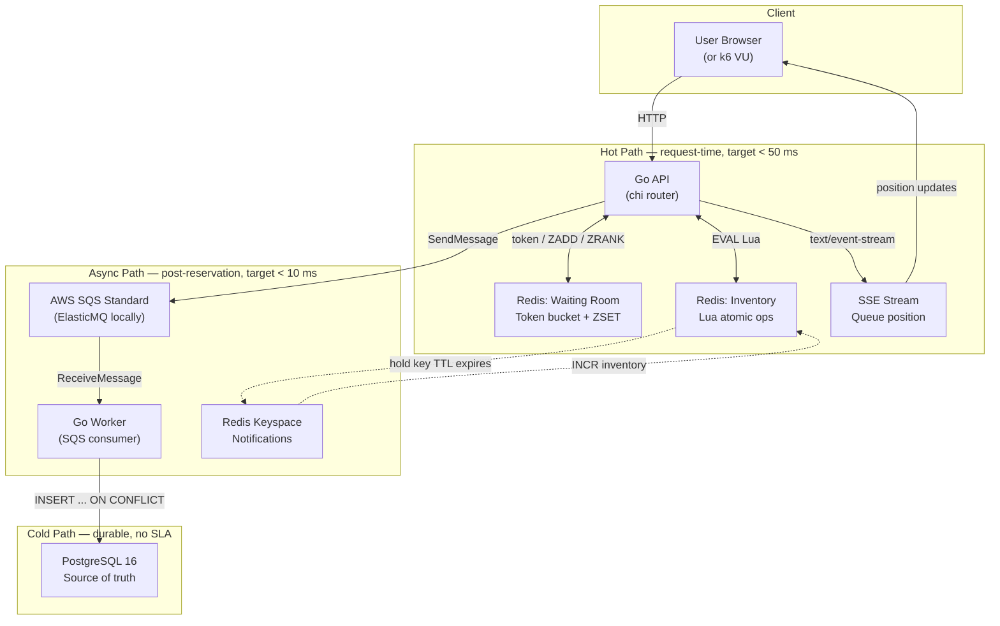

**Three latency tiers, each with its own SLA:**


| Tier      | Components         | Target          | Why                                                    |
| ----------- | -------------------- | ----------------- | -------------------------------------------------------- |
| **Hot**   | API ↔ Redis       | < 50 ms         | User is waiting for a seat; every ms matters           |
| **Async** | API → SQS         | < 10 ms publish | Only needs to enqueue; the user already has their seat |
| **Cold**  | Worker → Postgres | no SLA          | Durable record; out-of-band; no user impact            |

The cardinal rule: **Postgres never touches the hot path.** This is the design constraint that shapes every decision below.

---

## 2. The 3-Phase Gatekeeper

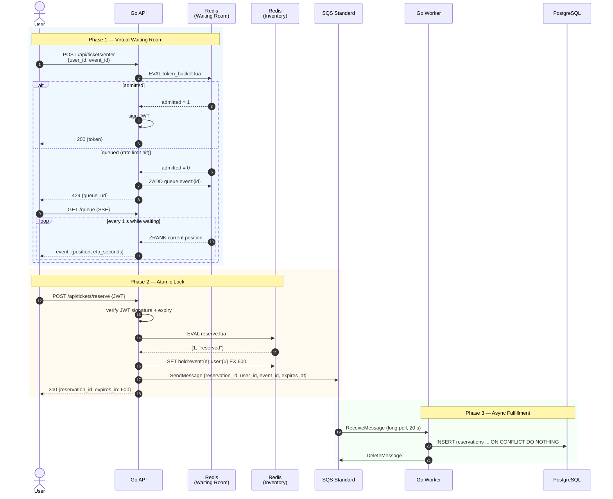

Each phase solves a different problem, and they compose:

- **Phase 1** keeps Phase 2 from being overwhelmed
- **Phase 2** keeps Phase 3's queue from being flooded with "almost-winners"
- **Phase 3** keeps the user-facing response time independent of Postgres latency

---

## 3. Phase 1 — Virtual Waiting Room

**Goal:** shed load *before* it reaches the inventory layer.

### Token bucket

A Redis-backed counter of available "admission tokens" per event. Refills at a fixed rate.

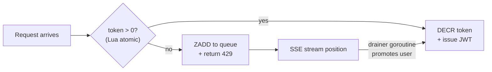

The Lua script for admission is intentionally trivial — a single `DECR` with a check. Everything interesting happens around it.

### Why a waiting room at all?

Without it, 1,000 simultaneous users would all race to invoke Phase 2's Lua script. Redis can handle that (50 µs per call = 20k calls/sec on a single node), but you'd waste:

- JWT signing CPU on requests that will inevitably get `sold_out`
- Network round-trips for users who refresh and retry
- Human attention, since users staring at a 10-second spinner hit refresh and multiply the load

The waiting room trades **uniform latency** for **fairness and stability**: a few users wait longer, but everyone gets a clean answer.

### The ZSET queue

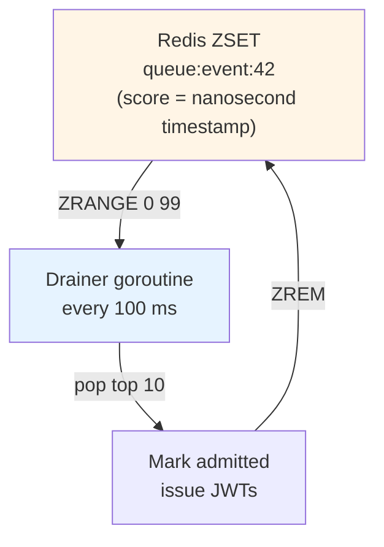

Ranking by **nanosecond timestamp** gives fair FIFO ordering. A drainer goroutine wakes every 100 ms, pops the top N (where N = refill rate / 10), promotes them to "admitted" status, and issues JWTs.

### SSE position updates

When a user is queued, they receive a `429` with a `queue_url`. The browser opens:

```
GET /api/tickets/queue?token=<short-lived-ticket> HTTP/1.1
Accept: text/event-stream
```

The server responds:

```
HTTP/1.1 200 OK
Content-Type: text/event-stream
Cache-Control: no-cache
Connection: keep-alive

event: position
data: {"position": 137, "eta_seconds": 14}

event: position
data: {"position": 98, "eta_seconds": 10}

...

event: admitted
data: {"token": "eyJhbGciOiJIUzI1NiIs..."}
```

**Why SSE, not WebSockets?** The data flows one way: server → client. SSE is built on `text/event-stream` over plain HTTP/1.1, works through every proxy, auto-reconnects on the client, and needs zero extra protocol. WebSockets would add framing, masking, ping/pong, and a separate upgrade handshake — for no benefit on a one-way stream.

---

## 4. Phase 2 — Atomic Seat Locking

**Goal:** guarantee that exactly N seats are allocated for N requests, even with millisecond-level concurrency.

### The Lua reservation script

```lua
-- KEYS[1] = seat_inventory_key   e.g. "inventory:event:42"
-- KEYS[2] = user_hold_key        e.g. "hold:event:42:user:abc123"
-- ARGV[1] = hold_ttl_seconds     e.g. "600" (10 minutes)
-- ARGV[2] = seats_requested      e.g. "1"

local available = tonumber(redis.call('GET', KEYS[1]))

if available == nil then
    return {-1, 'event_not_found'}        -- event was never seeded
end

local requested = tonumber(ARGV[2])
if available < requested then
    return {0, 'sold_out'}                -- not enough seats
end

-- Guard: same user can't double-book within their hold TTL
local existing_hold = redis.call('GET', KEYS[2])
if existing_hold then
    return {0, 'already_holding'}
end

redis.call('DECRBY', KEYS[1], requested)              -- commit the decrement
redis.call('SET', KEYS[2], ARGV[2], 'EX', ARGV[1])   -- create the hold with TTL

return {1, 'reserved'}
```

**Execution time:** ~50 µs on a single Redis node. Out of 1,000 requests racing for 10 seats, exactly 10 return `{1, "reserved"}`. The other 990 get `{0, "sold_out"}` in microseconds — **no DB call ever happens**.

### Why Redis Lua is atomic

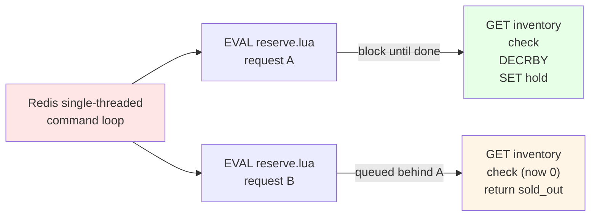

Redis runs all commands on a **single thread**. When you `EVAL` a Lua script, the server blocks on that thread until the script completes — no other command from any client can interleave. The script is a transaction by construction. You don't need `WATCH`/`MULTI`/`EXEC`, you don't need optimistic locking, you don't need to worry about retries.

This is the single most important property of the system. **Atomicity for free.**

### The hold key

A successful reservation creates a hold key (`hold:event:42:user:abc123`) with a **600-second TTL**. This serves three roles simultaneously:

1. **Anti-double-booking** — `GET` on this key blocks the same user from a second reservation within 10 minutes
2. **Auto-release on abandonment** — if the user closes the tab, the key expires and Redis fires a keyspace notification (see §9)
3. **No cron job for cleanup** — Redis itself enforces the TTL; no background sweeper required for the lock itself

---

## 5. Phase 3 — Asynchronous Fulfillment

**Goal:** persist confirmed holds to PostgreSQL *after* the user has secured their seat, never during the seat allocation race.

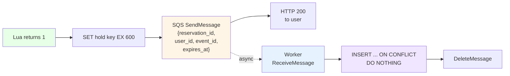

### The worker's idempotency contract

SQS Standard guarantees **at-least-once** delivery. The worker may receive the same message twice (visibility timeout, network blip, worker crash before delete). That's fine, *as long as the SQL is idempotent*.

```sql
INSERT INTO reservations
    (reservation_id, user_id, event_id, status, expires_at)
VALUES
    ($1, $2, $3, 'PENDING_PAYMENT', $4)
ON CONFLICT (reservation_id) DO NOTHING;
```

The `reservation_id` is a UUID generated by the API when the hold is created. The unique constraint on `reservation_id` (in the Postgres schema) means the second INSERT is a no-op. The worker can `DeleteMessage` either way.

**This is why we chose SQS Standard over FIFO.** FIFO has built-in dedup — but it's capped at 300 msg/s (3000 with batching), with extra cost. Standard has unlimited throughput; we get exactly-once *processing* by making the *database* the dedup layer. See §10 for the full reasoning.

---

## 6. TOCTOU and Why Lua Fixes It

**TOCTOU** = Time-of-Check to Time-of-Use. The bug class that owns most overselling incidents.

### Without Lua: the race

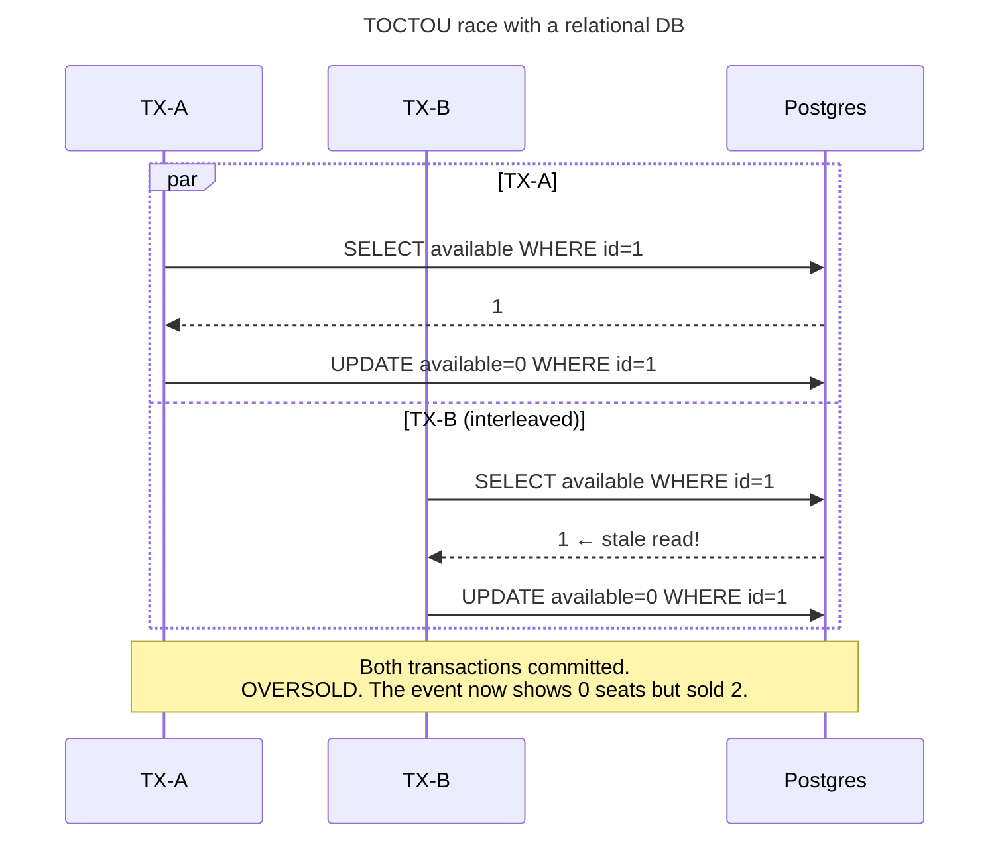

The window between `SELECT` and `UPDATE` is the TOCTOU window. With 1,000 concurrent transactions on the same row, this window opens thousands of times per second. `WHERE available > 0` does not save you — the predicate check happens at `UPDATE` time, but the *read* may have been from a stale snapshot.

You can fix this with `SELECT ... FOR UPDATE` or optimistic concurrency control, but every fix adds latency and complexity.

### With Redis Lua: no window

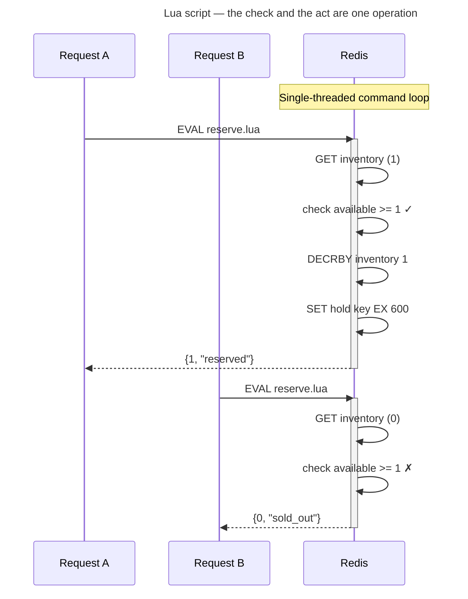

No window. The check (`GET inventory`) and the act (`DECRBY`) happen in the **same atomic step**. By the time Request B's script runs, the inventory is already 0.

---

## 7. The Two-State Model

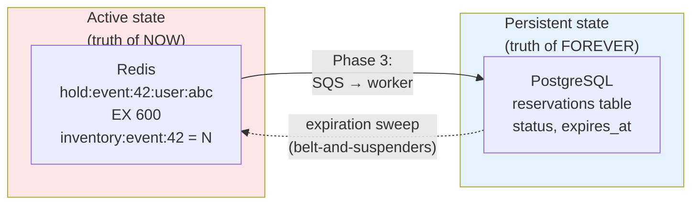


| Concern                   | Lives in | Lifetime           |
| --------------------------- | ---------- | -------------------- |
| "Who has what, right now" | Redis    | Hold TTL (~10 min) |
| "What was ever sold"      | Postgres | Forever            |

**The asymmetry is the point.** Redis is the hot, mutable, fast-fading truth of "this user's seat is reserved, expires in 9m 42s." Postgres is the slow, immutable, forever-true ledger of confirmed orders. They serve different access patterns.

You never read from Postgres in the hot path. You never trust Redis for durability.

---

## 8. Reservation Lifecycle

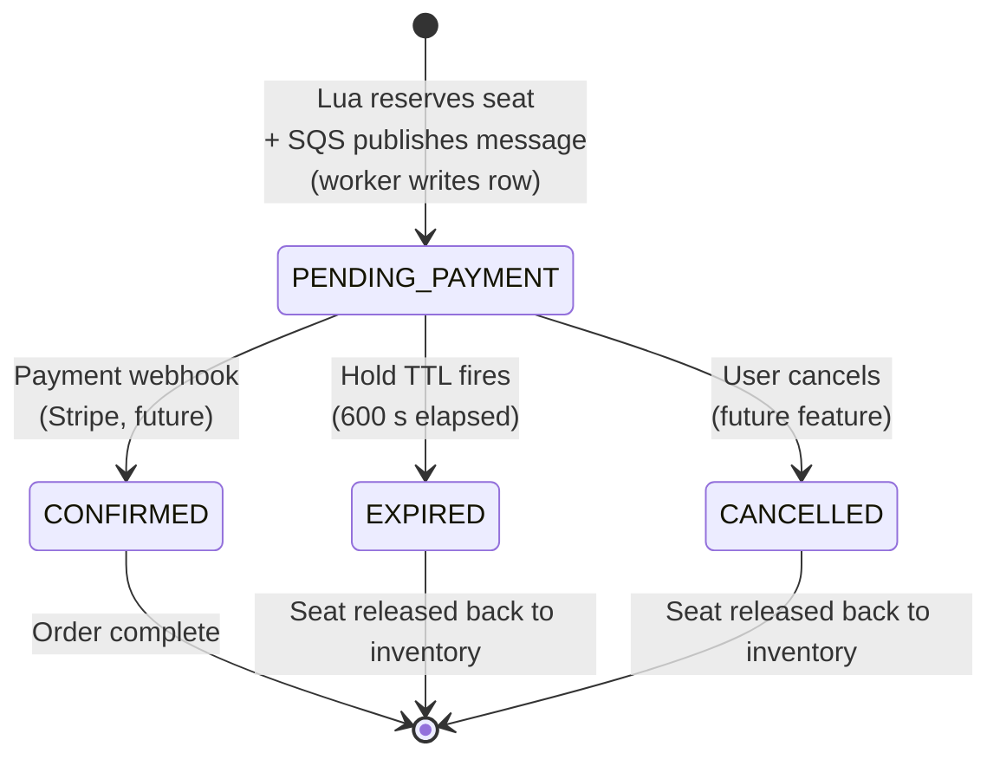

The system has **four terminal states** (`CONFIRMED`, `EXPIRED`, `CANCELLED`, plus the implicit "deleted before insert" if the worker can't write to Postgres). `PENDING_PAYMENT` is the only transitional state.

---

## 9. Handling Expirations

When a user abandons payment, two things must happen:

1. The Redis hold key expires (Redis itself does this — no code needed)
2. The seat inventory must be incremented so the ticket becomes available again

### Approach A: Redis Keyspace Notifications (event-driven)

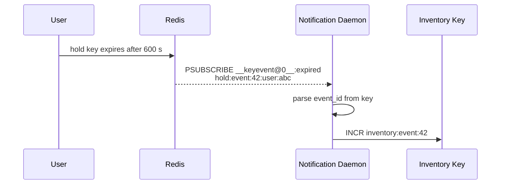

Enable in `redis.conf`:

```bash
notify-keyspace-events Ex
```

The `Ex` flag means "publish expired-key events." A Go daemon subscribes via PSUBSCRIBE, parses the event_id from the key name, and runs `INCR inventory:event:{id}`.

**Caveat:** Redis keyspace notifications have **no delivery guarantee**. If the daemon is down or misses the message, the seat is stuck.

### Approach B: Periodic sweep (belt-and-suspenders)

A Go cron job runs every 60 seconds and queries:

```sql
SELECT reservation_id, event_id
FROM reservations
WHERE status = 'PENDING_PAYMENT'
  AND expires_at < NOW();
```

For each expired reservation, the sweeper issues the compensating `INCR` in Redis. This is less elegant but more robust — it catches what keyspace notifications dropped.

**In production, run both.** Keyspace notifications handle 99% of cases in real-time; the sweep is the safety net.

---

## 10. Why SQS Standard (Not FIFO)

The original design used SQS FIFO. We switched. Here's why.

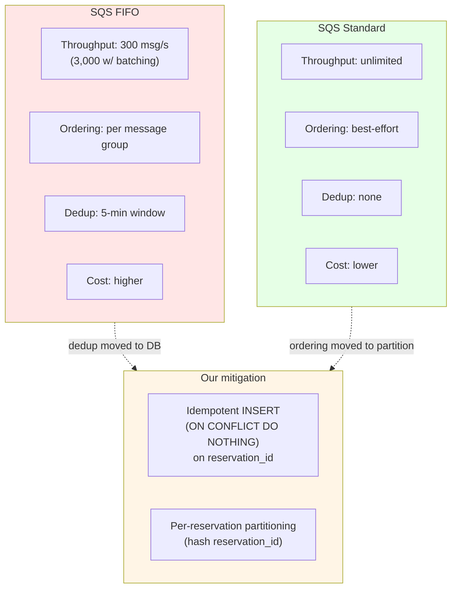


| Concern              | FIFO's answer   | Our answer                                                                      |
| ---------------------- | ----------------- | --------------------------------------------------------------------------------- |
| Duplicate processing | Built-in dedup  | `ON CONFLICT DO NOTHING` on `reservation_id`                                    |
| Ordering             | Message groups  | Hash partition on`reservation_id` (same key → same partition → same consumer) |
| Throughput           | Capped at 300/s | Unlimited                                                                       |

**The math:** Taylor Swift drops 150,000 tickets in 60 seconds = 2,500/sec sustained. FIFO caps at 300/s. We'd need 9 FIFO queues with message-group sharding just to keep up. Standard gives us the headroom for free; we pay for it with idempotent worker writes (which we'd need anyway, because FIFO dedup isn't bulletproof either).

---

## 11. Failure Modes & Mitigations


| #  | Failure                          | Where it hurts                  | Mitigation                                                                                            |
| ---- | ---------------------------------- | --------------------------------- | ------------------------------------------------------------------------------------------------------- |
| 1  | Redis goes down                  | Hot path dies                   | Sentinel + replica failover (sub-second promotion); API returns 503 from health check                 |
| 2  | SQS unreachable                  | Worker can't process            | Buffer locally, retry with exponential backoff; user already has their seat in Redis                  |
| 3  | Worker dies mid-INSERT           | Message redelivered             | `ON CONFLICT DO NOTHING` on `reservation_id` makes the retry safe                                     |
| 4  | Postgres unreachable             | Worker can't persist            | Message stays in SQS (visibility timeout expires → redelivered); seat is safe in Redis               |
| 5  | Lua script crashes mid-execution | Connection error to caller      | Redis aborts the script; inventory unchanged; caller retries                                          |
| 6  | Token bucket under-fills         | Legit users get queued unfairly | Calibrate refill rate; expose metric on`bucket:event:{id}` value                                      |
| 7  | Hold key expires before payment  | User loses seat                 | Acceptable — 10 min is industry standard; bump to 15 if business wants                               |
| 8  | Keyspace notification dropped    | Stale inventory                 | Sweep job (Approach B) catches it within 60 s                                                         |
| 9  | Clock skew between Redis and API | Hold expiry miscalculated       | All TTLs are relative durations from Redis`SET ... EX` — not absolute timestamps for the hold itself |
| 10 | DDoS at the waiting room         | Bucket exhausted forever        | Per-IP token bucket layer in front of the per-event bucket                                            |

---

## 12. Known Development Sharp Edges

*Gotchas that cost debugging time during Phase 0. Save future-us the same headache.*

### ElasticMQ healthcheck: use `curl`, not `wget` or `/dev/tcp`

The image's shell is **alpine `sh` (busybox)**, and a bare `GET /` against ElasticMQ returns **HTTP 400**. That breaks two seemingly-obvious healthchecks:

| Approach | Why it fails |
|---|---|
| `wget -q --spider http://localhost:9324/` | Exits with code **8** on the 400 response → false negative |
| `exec 3<>/dev/tcp/127.0.0.1/9324` | `/dev/tcp` is **bash-only**; alpine `sh` says *"cannot create: Directory nonexistent"* |

**The fix** — `curl` exits 0 on any HTTP response, so we succeed whenever TCP is up:

```yaml
test: ["CMD-SHELL", "curl -s -o /dev/null http://127.0.0.1:9324/"]
```

Use this shape for any future docker-compose SQS-compatible service.

---

## See also

- [README](../README.md) — project landing page
- `/docs/tooling.md` (coming soon) — why each tool was chosen
- `/docs/loadtest.md` (coming soon) — k6 script walkthrough and what each threshold means
- `/docs/operations.md` (coming soon) — running in production (deploy, monitor, on-call)
