# Architecture Deep-Dive

> The full story behind Mini-Ticketmaster — what each piece does, why it exists, and what failure it prevents.

This document complements the [README](../README.md). The README is the project landing page; this is the engineering manual. **§1–§12 explain the design**, **§13 is a per-file reference** for when you need to find or modify a specific file.

**Code state reflected:** through Phase 8 (Load test + invariants). Phases 0–8 are landed; the headline test (`loadtest/burst.js`, 1000 VUs, event_id=1, inv=100) produces exactly 100 × 200 + 900 × 409 — see the [Load testing](../README.md#load-testing-k6--live-dashboard) section of the README. Phase 9 (polish) is next.

---

## Table of Contents

1. [System Overview](#1-system-overview)
2. [The 3-Phase Gatekeeper](#2-the-3-phase-gatekeeper)
3. [Phase 1 — Virtual Waiting Room](#3-phase-1--virtual-waiting-room)
4. [Phase 2 — Atomic Seat Locking](#4-phase-2--atomic-seat-locking)
5. [Phase 3 — Asynchronous Fulfillment](#5-phase-3--asynchronous-fulfillment)
6. [TOCTOU and Why Lua Fixes It](#6-toctou-and-why-lua-fixes-it)
7. [The Two-State Model](#7-the-two-state-model)
8. [Reservation Lifecycle](#8-reservation-lifecycle)
9. [Handling Expirations](#9-handling-expirations)
10. [Why SQS Standard (Not FIFO)](#10-why-sqs-standard-not-fifo)
11. [Failure Modes & Mitigations](#11-failure-modes--mitigations)
12. [Known Development Sharp Edges](#12-known-development-sharp-edges)
13. [File-by-File Reference](#13-file-by-file-reference)

---

## 1. System Overview

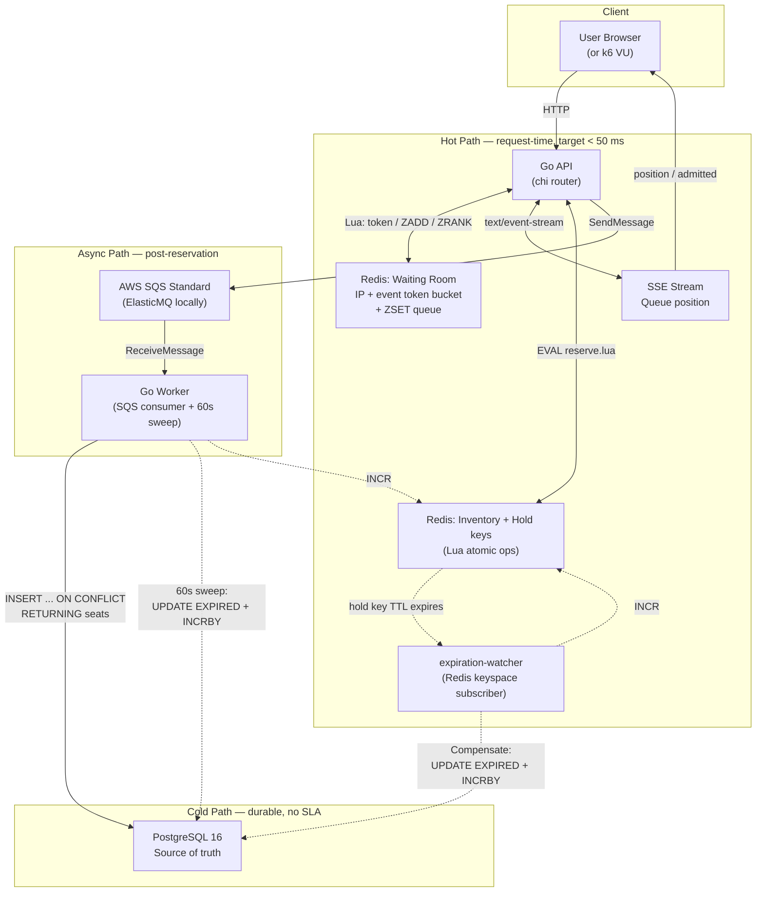

**Four latency tiers, each with its own SLA:**


| Tier      | Components                 | Target          | Why                                                    |
| ----------- | ---------------------------- | ----------------- | -------------------------------------------------------- |
| **Hot**   | API ↔ Redis               | < 50 ms         | User is waiting for a seat; every ms matters           |
| **Async** | API → SQS                 | < 10 ms publish | Only needs to enqueue; the user already has their seat |
| **Watch** | watcher ↔ Redis keyspace  | ~ real-time     | Catch expiries as they fire                            |
| **Cold**  | Worker → Postgres (sweep) | every 60 s      | Safety net for missed keyspace events                  |

The cardinal rule: **Postgres never touches the hot path.** This is the design constraint that shapes every decision below.

---

## 2. The 3-Phase Gatekeeper

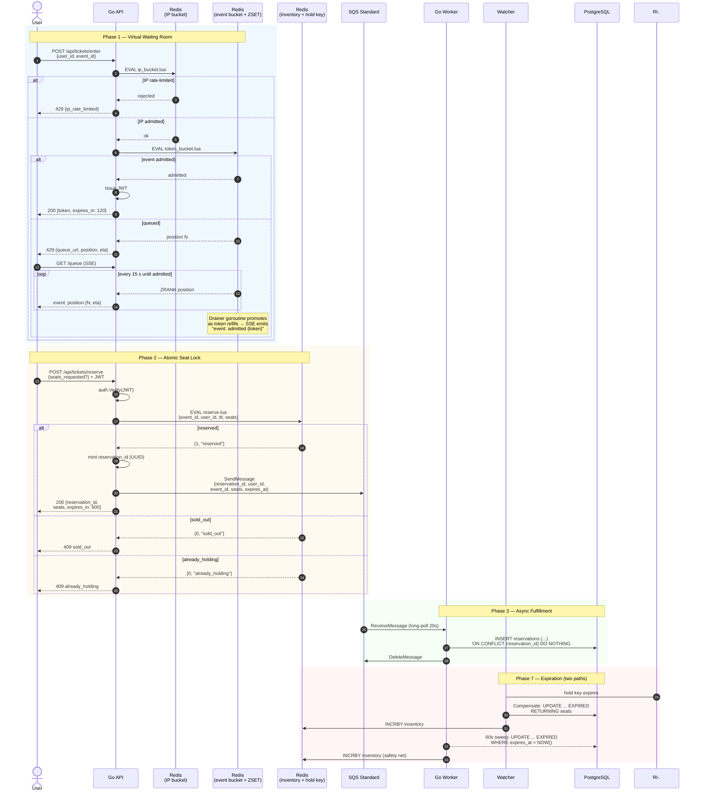

Each phase solves a different problem and they compose:

- **Phase 1** keeps Phase 2 from being overwhelmed (and blocks bulk bots via the IP tier)
- **Phase 2** keeps Phase 3's queue from being flooded with "almost-winners"
- **Phase 3** keeps the user-facing response time independent of Postgres latency
- **Phase 7** returns inventory when a hold expires, by either event-driven (fast) or DB-sweep (safe) path

---

## 3. Phase 1 — Virtual Waiting Room

**Goal:** shed load *before* it reaches the inventory layer. The unique wrinkle vs. naive rate limiting is the **two-tier gate**: a per-IP bucket kills bulk abuse; a per-event bucket handles legitimate burst.

### Two-tier admission

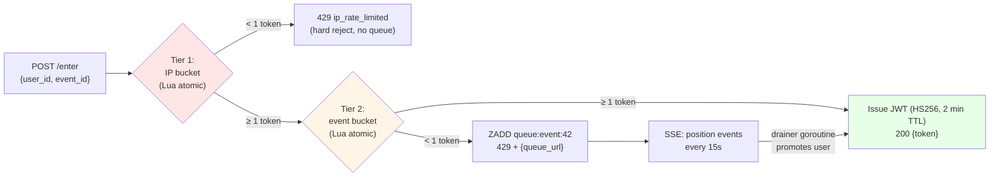

**Why two tiers?** A per-IP bucket is cheaper than a per-event bucket to evaluate, but it can't be the only defense — one attacker with 10,000 residential IPs would each get the full burst. The per-event bucket caps *total* admission regardless of attacker count.

### Tier 1: IP bucket (`internal/iplimit/scripts/ip_bucket.lua`)

Classic lazy-refill token bucket:

- State per IP: Redis Hash `{tokens, last_refill_ms}` (one key per IP, e.g. `ip:1.2.3.4`)
- On call: compute elapsed time → refill `tokens = min(capacity, tokens + elapsed * refill_rate)` → consume one if available
- 1-day TTL on the bucket state (safety net against stale entries)
- **Hard reject** on exhaustion — no queue, no fairness for bots

### Tier 2: Event bucket + ZSET queue (`internal/redis/scripts/token_bucket.lua`)

Same shape, but with an overflow queue:

- State per event: Redis Hash `{tokens, last_refill_ms}` (key: `bucket:event:42`)
- Queue: Redis ZSET (key: `queue:event:42`), scored by **nanosecond timestamp** for fairness
- On call: refill → consume if available; else `ZREMRANGEBYSCORE` to drop stale entries, `ZADD now user`, return 1-based position
- Queue TTL is refreshed on every insert (track current and stale)

### The drainer goroutine (`internal/waitingroom/drainer.go`)

A long-lived goroutine in the API process. Lazily spawns one sub-loop per event that currently has a queue; sub-loop exits after 5 minutes of empty queue.

Every tick (100 ms):

1. `ZCARD queue:event:42` — how many people waiting?
2. Compute `tokensToAdd = refill_rate * tick_interval` (capped at queue size, floor of 1)
3. For each token: `ZPOPMIN` (FIFO), `Issue` JWT, `Deliver` to the user's SSE channel

The drainer and the SSE goroutines communicate via an in-process `map[eventID:userID]chan string` (`internal/waitingroom/queue.go`). At Phase 4 scale (thousands, not millions) an in-process registry is simpler and faster than Redis pub/sub.

### SSE position updates

When queued, the user receives `429 {queue_url}` and opens an SSE stream:

```
GET /api/tickets/queue?event_id=42&user_id=alice HTTP/1.1
Accept: text/event-stream
```

```
HTTP/1.1 200 OK
Content-Type: text/event-stream

event: position
data: {"position": 137, "eta_seconds": 14}

event: position
data: {"position": 98, "eta_seconds": 10}

event: admitted
data: {"token": "eyJhbGciOiJIUzI1NiIs..."}
```

The handler runs a goroutine that listens on three things at once (`select{}`): the admission channel, a 15-second heartbeat ticker (re-reads `ZRANK` to keep the position fresh), and the request context (fires when the client disconnects).

**Why SSE, not WebSockets?** Data flows one way: server → client. SSE is plain `HTTP/1.1`, auto-reconnects on the client, works through every proxy, and needs zero framing/upgrade ceremony — WebSockets would add framing, masking, ping/pong, and a separate handshake for no benefit.

---

## 4. Phase 2 — Atomic Seat Locking

**Goal:** guarantee that exactly N seats are allocated for N requests, even with millisecond-level concurrency.

### The Lua reservation script (`internal/redis/scripts/reserve.lua`)

```lua
-- KEYS[1] = seat_inventory_key   e.g. "inventory:event:42"
-- KEYS[2] = user_hold_key        e.g. "hold:event:42:user:abc123"
-- ARGV[1] = hold_ttl_seconds     e.g. "600" (10 minutes)
-- ARGV[2] = seats_requested      e.g. "1" (max 10 — see API handler validation)

local available = tonumber(redis.call('GET', KEYS[1]))

if available == nil then
  return {-1, 'event_not_found'}        -- event was never seeded
end

local requested = tonumber(ARGV[2])
if available < requested then
  return {0, 'sold_out'}                -- not enough seats
end

-- Guard: same user can't double-book within their hold TTL
local existing_hold = redis.call('GET', KEYS[2])
if existing_hold then
  return {0, 'already_holding'}
end

redis.call('DECRBY', KEYS[1], requested)            -- commit the decrement
redis.call('SET', KEYS[2], ARGV[2], 'EX', ARGV[1])   -- hold key TTL + seats count

return {1, 'reserved'}
```

**Execution time:** ~50 µs on a single Redis node. Out of 1,000 requests racing for 10 seats, exactly 10 return `{1, "reserved"}`. The other 990 get `{0, "sold_out"}` in microseconds — **no DB call ever happens**.

### Why Redis Lua is atomic

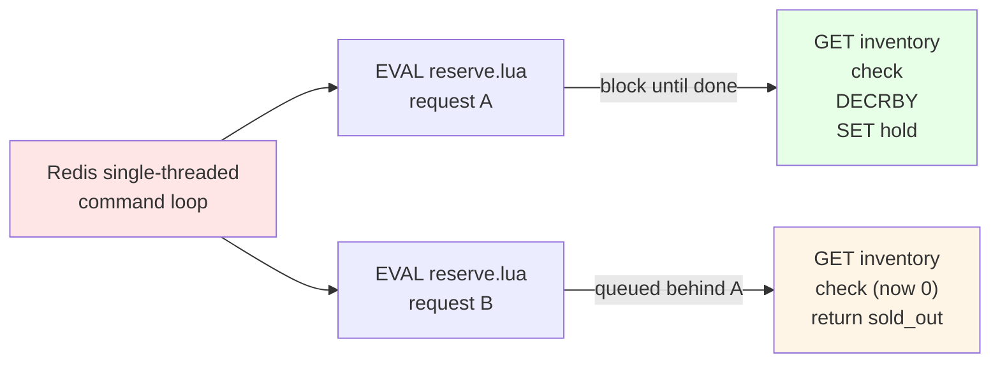

Redis runs all commands on a **single thread**. When you `EVAL` a Lua script, the server blocks on that thread until the script completes — no other command from any client can interleave. The script is a transaction by construction. You don't need `WATCH`/`MULTI`/`EXEC`, you don't need optimistic locking, you don't need to worry about retries.

**This is the single most important property of the system. Atomicity for free.**

### The hold key

A successful reservation creates a hold key (`hold:event:42:user:abc123`) with a **600-second TTL**. The *value* of the key is the seats count (so Phase 7's keyspace watcher can know how many to INCRBY without a DB round-trip — see §9).

The hold key serves **four** roles simultaneously:

1. **Anti-double-booking** — `GET` blocks the same user from a second reservation within 10 minutes
2. **Auto-release on abandonment** — TTL expires → Redis fires keyspace notification → watcher compensates
3. **No cron job for cleanup** — Redis itself enforces the TTL; no background sweeper required for the lock itself
4. **Seats payload for compensation** — the value is the seat count, readable when needed

### Seat limits

The API handler (`internal/api/reserve_handler.go`) enforces `1 ≤ seats_requested ≤ 10`. The DB schema (`migrations/003_add_seats.sql`) mirrors that with a `CHECK (seats >= 1 AND seats <= 10)` constraint.

---

## 5. Phase 3 — Asynchronous Fulfillment

**Goal:** persist confirmed holds to PostgreSQL *after* the user has secured their seat, never during the seat allocation race.

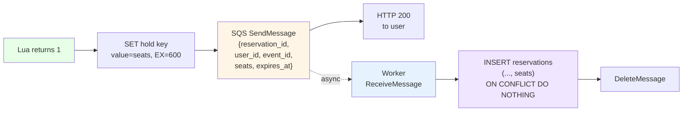

### Publisher interface seam

The handler doesn't import SQS directly — it depends on `api.ReservationPublisher` (`internal/api/publisher.go`), a one-method interface:

```go
type ReservationPublisher interface {
    Publish(ctx context.Context, body []byte) error
}
```

Two implementations:

- **`LogPublisher`** — Phase 5 stub. Writes `[STUB SQS publish] {…}` to the log. Used in dev environments with `SQS_QUEUE_URL` unset.
- **`ReservationAPIPublisher`** — Phase 6. Unmarshals the body (round-trip acts as wire-format validation), then forwards to an inner `SQSPublisher`, which marshals back to JSON for `sqs.SendMessage`. The double marshal is a few microseconds — cheap insurance against silent drift between API and worker.

Wiring happens once in `cmd/api/main.go`'s `buildPublisher()`. **If `SQS_QUEUE_URL == ""`, the function falls back to `LogPublisher`** so the API stays runnable for handler-level work even without SQS configured.

### The worker's idempotency contract

SQS Standard guarantees **at-least-once** delivery. The worker may receive the same message twice (visibility timeout, network blip, crash before delete). That's fine, *as long as the SQL is idempotent*:

```sql
INSERT INTO reservations
    (reservation_id, user_id, event_id, status, expires_at, seats)
VALUES
    ($1, $2, $3, 'PENDING_PAYMENT', $4, $5)
ON CONFLICT (reservation_id) DO NOTHING;
```

The `reservation_id` is a UUID generated by the API when the hold is created. The `UUID PRIMARY KEY` constraint on the table means the second INSERT is a no-op. The worker can `DeleteMessage` either way — `tag.RowsAffected() == 0` is informational, not an error.

**This is why we chose SQS Standard over FIFO.** FIFO has built-in dedup — but it's capped at 300 msg/s, with extra cost. Standard has unlimited throughput; we get exactly-once *processing* by making the *database* the dedup layer. See §10 for the full reasoning.

### At-least-once in practice

`internal/queue/consumer.go::Poll` long-polls in 20-second waits (capped by SQS), receives up to 10 messages per call, dispatches each to a `MessageHandler`:

- `handler` returns `nil` → `DeleteMessage` (success path)
- `handler` returns `err` → leave visible (SQS will redeliver after visibility timeout)
- `Poll`'s `ReceiveMessage` errors → log, 1-second backoff, retry
- `Poll`'s `DeleteMessage` errors after success → log and move on (the DB row already exists; idempotency absorbs the redelivery)

The worker binary runs `Poll` in its main goroutine and watches `signal.NotifyContext(SIGINT, SIGTERM)` for graceful shutdown.

---

## 6. TOCTOU and Why Lua Fixes It

**TOCTOU** = Time-of-Check to Time-of-Use. The bug class that owns most overselling incidents.

### Without Lua: the race

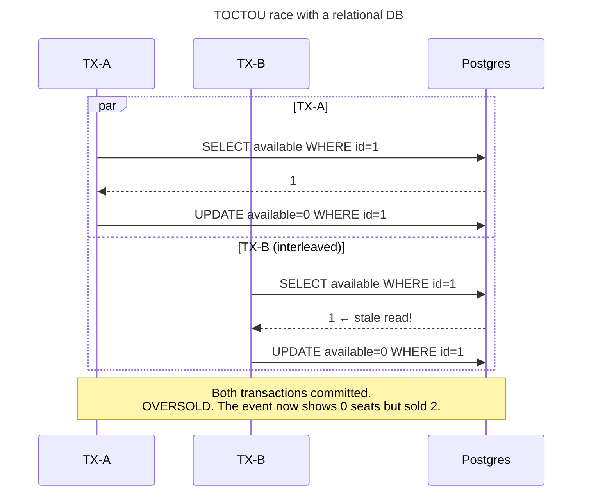

The window between `SELECT` and `UPDATE` is the TOCTOU window. With 1,000 concurrent transactions on the same row, this window opens thousands of times per second. `WHERE available > 0` does not save you — the predicate check happens at `UPDATE` time, but the *read* may have been from a stale snapshot.

You can fix this with `SELECT ... FOR UPDATE` or optimistic concurrency control, but every fix adds latency and complexity.

### With Redis Lua: no window

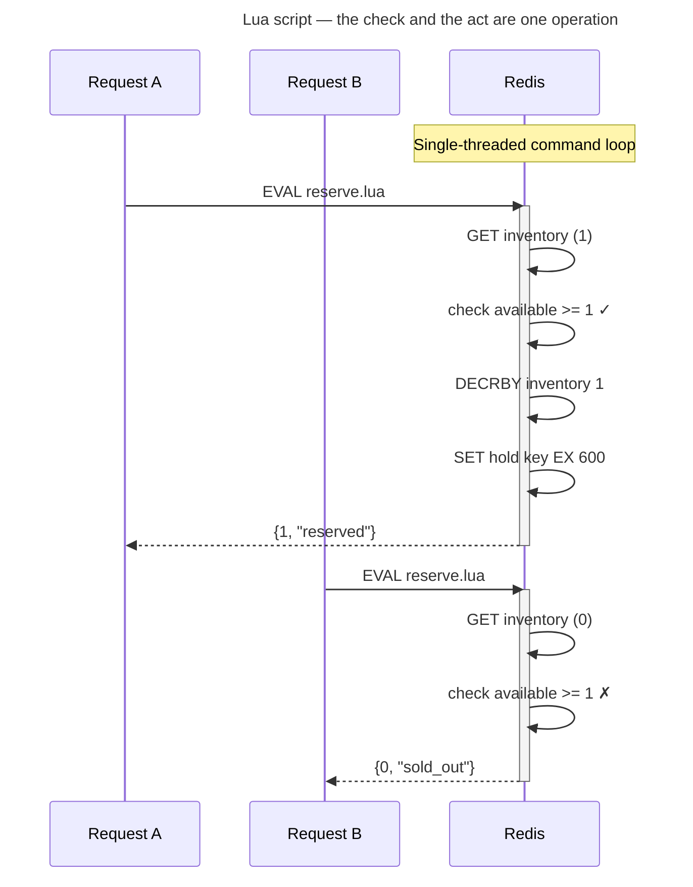

No window. The check (`GET inventory`) and the act (`DECRBY`) happen in the **same atomic step**. By the time Request B's script runs, the inventory is already 0.

---

## 7. The Two-State Model

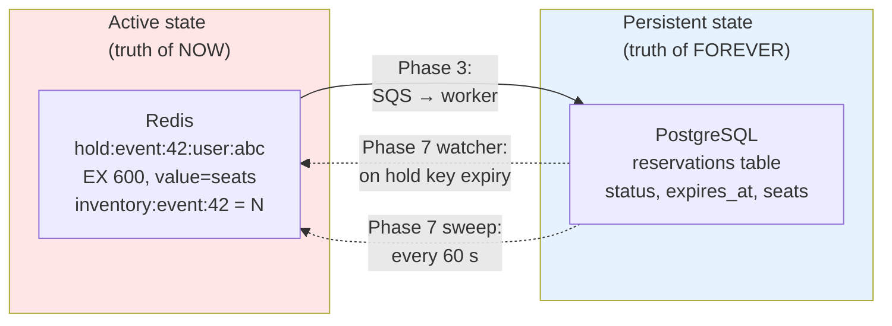


| Concern                                | Lives in | Lifetime           |
| ---------------------------------------- | ---------- | -------------------- |
| "Who has what, right now"              | Redis    | Hold TTL (~10 min) |
| "What was ever sold, with what status" | Postgres | Forever            |

**The asymmetry is the point.** Redis is the hot, mutable, fast-fading truth of "this user's seat is reserved, expires in 9m 42s." Postgres is the slow, immutable, forever-true ledger of confirmed orders. They serve different access patterns.

You never read from Postgres in the hot path. You never trust Redis for durability.

Phase 7 closes the asymmetry: Postgres's truth can *correct* Redis's truth (sweep). For 99% of cases, Redis drives Postgres (worker INSERT). For the rare lost-notification case, Postgres drives Redis (sweep INCRBY).

---

## 8. Reservation Lifecycle

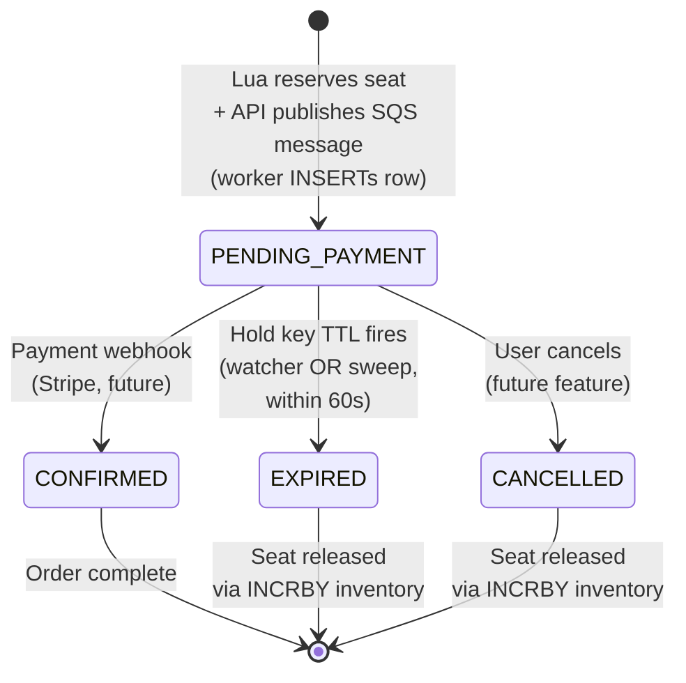

**Four terminal states** (`CONFIRMED`, `EXPIRED`, `CANCELLED`, plus the implicit "no row ever written" if the worker never gets the SQS message). `PENDING_PAYMENT` is the only transitional state.

The `status` column has a `CHECK` constraint enforcing this set (`migrations/001_init.sql`), and `internal/db/reservations.go` exposes the four values as typed constants (`StatusPendingPayment`, etc.) so a typo at a call site fails to compile.

Phase 7 owns `PENDING_PAYMENT → EXPIRED` (with two redundant paths — see §9).

---

## 9. Handling Expirations

The lifecycle's `PENDING_PAYMENT → EXPIRED` transition needs two things to happen atomically: the DB row flips to `EXPIRED` and the Redis inventory counter goes back up. Phase 7 ships **two redundant paths** so neither can lose a seat.

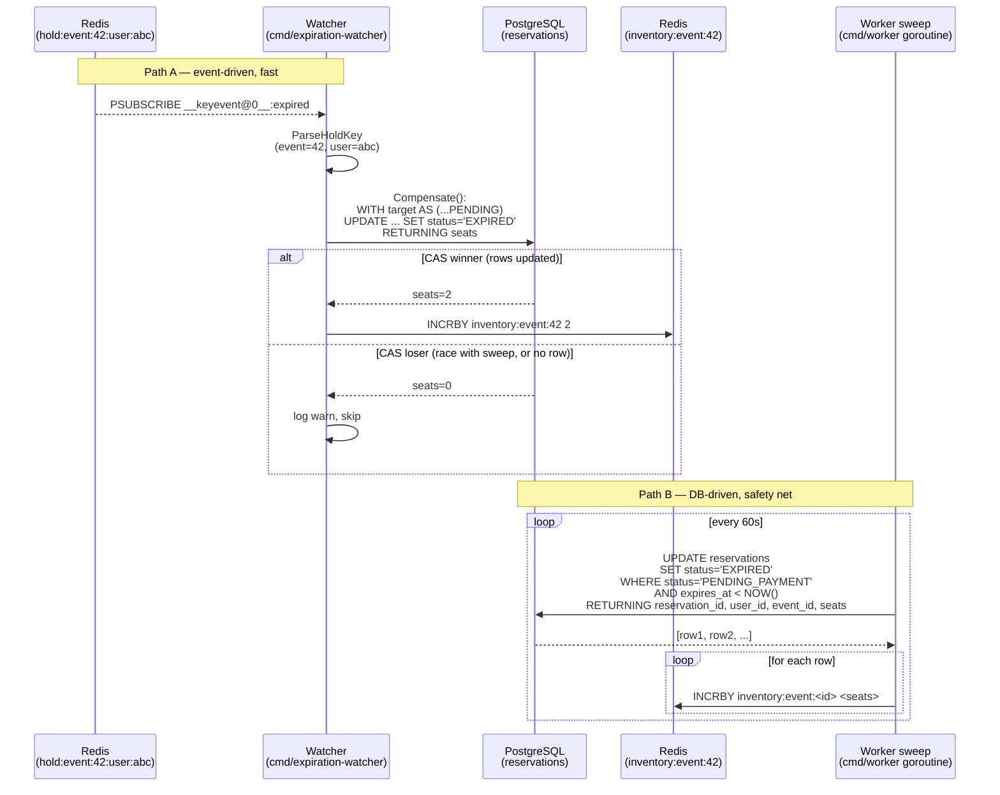

### The shared `Compensate` function

Both paths converge on `internal/expire/compensate.go::Compensate(ctx, pool, rdb, eventID, userID)`:

1. **CAS UPDATE** — single CTE that finds the matching `PENDING_PAYMENT` row for `(user_id, event_id)` and flips it to `EXPIRED`, returning the seat count. The `WHERE status='PENDING_PAYMENT'` filter is the compare-and-set: a second concurrent caller sees 0 rows and skips the INCRBY.
2. **INCRBY inventory** — `INCRBY inventory:event:<id> <seats>` using the row's `seats` value (persisted via migration `003_add_seats.sql`).

This function is the only thing both paths need to share. Putting it in one place means the watcher's event path and the worker's sweep path can never drift.

### Path A: Keyspace watcher (`cmd/expiration-watcher`)

A separate binary that runs `expire.RunWatcher(ctx, rdb, pool)`:

1. `PSUBSCRIBE __keyevent@0__:expired` (DB 0 is the only DB this app uses)
2. On each message, `expire.ParseHoldKey(key)` extracts `(eventID, userID)`. Keys that don't match `hold:event:N:user:U` are filtered out — the expired channel fires for **every** expired key, including ZSET members and bucket state.
3. Valid keys go to `Compensate(ctx, pool, rdb, eventID, userID)`.

**Reconnect strategy:** go-redis PubSub doesn't auto-reconnect on connection drop. `RunWatcher` wraps the subscribe loop with exponential backoff (1 s → 2 → 4 → … → 30 s cap). After a clean subscribe, backoff resets to 1 s.

**Configuration:** `DATABASE_URL` + `REDIS_ADDR` env vars. Defaults to `localhost:6379`.

### Path B: DB-driven sweep (`cmd/worker` goroutine)

The worker runs `expire.RunSweep(ctx, pool, rdb, interval)` as a goroutine alongside the SQS poll loop.

Every `interval` (default 60 s; env `SWEEP_INTERVAL_SECONDS`):

1. `FindAndExpireSweptRows` runs the atomic SQL:
   ```sql
   UPDATE reservations
   SET status = 'EXPIRED', updated_at = NOW()
   WHERE status = 'PENDING_PAYMENT' AND expires_at < NOW()
   RETURNING reservation_id, user_id, event_id, seats;
   ```
2. For each returned row, `INCRBY inventory:event:<id> <seats>`.

**Idempotent** — the `WHERE` clause limits to currently-`PENDING_PAYMENT` rows, so a second tick finds nothing to do.

### Race resolution

If both paths fire for the same `(user, event)`:


| Path                                  | What happens                                                                                                             |
| --------------------------------------- | -------------------------------------------------------------------------------------------------------------------------- |
| Watcher CAS wins, sweep runs after    | Sweep's UPDATE finds 0 rows (status already EXPIRED). Sweep's INCRBY doesn't run.**Total INCRBY: 1.** ✓                 |
| Sweep runs first, watcher fires after | Watcher's CAS finds 0 rows (status already EXPIRED). Watcher's INCRBY doesn't run.**Total INCRBY: 1.** ✓                |
| Both run concurrently                 | Postgres row-locking serializes the UPDATEs. Whichever commits first wins; the other sees 0 rows.**Total INCRBY: 1.** ✓ |

The `WHERE status='PENDING_PAYMENT'` is the entire mechanism. No distributed locks, no coordination protocol.

### Configuration


| Env var                  | Default          | Used by                 |
| -------------------------- | ------------------ | ------------------------- |
| `SWEEP_INTERVAL_SECONDS` | `60`             | Worker sweep tick rate  |
| `REDIS_ADDR`             | `localhost:6379` | Both watcher and worker |

Redis must be started with `--notify-keyspace-events Ex` (`docker-compose.yml` already does this) for any of Path A to fire.

### Caveat: orphan hold keys

The Lua reserve script always publishes SQS *after* creating the hold key. If SQS publish fails between those two steps, the API logs the error but the Redis hold key remains. The Lua committed, but no DB row will ever be written.

When the hold key fires the keyspace notification, `Compensate` finds no DB row → seats=0 → no INCRBY. The seat is **stuck held forever** until a manual operator intervention.

This is the documented edge case from `internal/expire/compensate.go`. To close it would require a Redis-side companion key that survives the TTL (uglier than the current trade-off), or a recovery scan over all `hold:*` keys with no matching DB row (O(inventory) work per restart).

---

## 10. Why SQS Standard (Not FIFO)

The original design used SQS FIFO. We switched. Here's why.

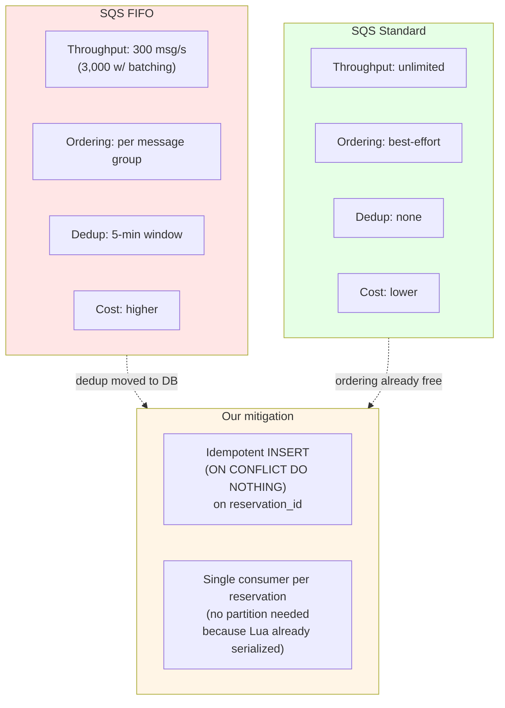


| Concern              | FIFO's answer   | Our answer                                                                          |
| ---------------------- | ----------------- | ------------------------------------------------------------------------------------- |
| Duplicate processing | Built-in dedup  | `ON CONFLICT DO NOTHING` on `reservation_id`                                        |
| Ordering             | Message groups  | Already free — each reservation only flows through the worker's single INSERT path |
| Throughput           | Capped at 300/s | Unlimited                                                                           |

**The math:** Taylor Swift drops 150,000 tickets in 60 seconds = 2,500/sec sustained. FIFO caps at 300/s. We'd need 9 FIFO queues with message-group sharding just to keep up. Standard gives us the headroom for free; we pay for it with idempotent worker writes (which we'd need anyway, because FIFO dedup isn't bulletproof either — it only deduplicates within a 5-minute window).

---

## 11. Failure Modes & Mitigations


| #  | Failure                              | Where it hurts                        | Mitigation                                                                                                                     |
| ---- | -------------------------------------- | --------------------------------------- | -------------------------------------------------------------------------------------------------------------------------------- |
| 1  | Redis goes down                      | Hot path dies                         | Sentinel + replica promotion (sub-second); API returns 503 from health check                                                   |
| 2  | SQS unreachable                      | API can't publish                     | Log + continue (Redis hold is created; orphan hold key — see §9 caveat)                                                      |
| 3  | Worker dies mid-INSERT               | Message redelivered                   | `ON CONFLICT (reservation_id) DO NOTHING` makes the retry safe                                                                 |
| 4  | Postgres unreachable                 | Worker can't persist                  | Message stays in SQS (visibility timeout expires → redelivered); seat is safe in Redis                                        |
| 5  | Lua script crashes mid-execution     | Connection error to caller            | Redis aborts the script; inventory unchanged; caller retries                                                                   |
| 6  | Token bucket under-fills             | Legit users queued unfairly           | Calibrate`WAIT_ROOM_REFILL_RATE`; expose metric on `bucket:event:<id>`                                                         |
| 7  | Hold key expires before payment      | User loses seat                       | Acceptable — 10 min is industry standard; bump via`RESERVE_HOLD_TTL_SECONDS`                                                  |
| 8  | Keyspace notification dropped        | Stale inventory                       | Sweep job catches within 60 s (Path B in §9)                                                                                  |
| 9  | Watcher process down                 | Real-time compensation stops          | Sweep continues to catch missed expirations within 60 s; spawn multiple replicas for high availability                         |
| 10 | Clock skew between Redis and API     | Hold expiry miscalculated             | All TTLs are relative durations from Redis`SET ... EX` — not absolute timestamps                                              |
| 11 | DDoS at the waiting room             | Bucket exhausted forever              | Per-IP token bucket tier (`internal/iplimit/`) rejects before the event bucket is touched                                      |
| 12 | Orphan hold key (no DB row)          | Seat stuck held forever               | Logged by`Compensate`; operator must manually INCR inventory (see §9 caveat)                                                  |
| 13 | INCRBY fails after DB EXPIRED flip   | DB says released, Redis says sold     | `Compensate` logs `WARN`; sweep won't re-process (status is EXPIRED). Operator alerting required.                              |
| 14 | AWS SDK initialized with empty creds | SQS client fails on first SendMessage | `internal/queue/aws.go` injects dummy `local/local` creds when `SQS_ENDPOINT_URL` is non-empty. **Local dev only** — see §12 |

---

## 12. Known Development Sharp Edges

*Gotchas that cost debugging time during Phase 0–7. Save future-us the same headache.*

### 1. AWS SDK requires non-empty credentials even with a custom endpoint

The `aws-sdk-go-v2` SQS client fails on first send with `NoCredentialProviders` if both `AWS_ACCESS_KEY_ID` and `AWS_SECRET_ACCESS_KEY` are empty — **even when** you've pointed it at `http://localhost:9324` via `SQS_ENDPOINT_URL`. ElasticMQ does not authenticate, but the SDK still requires credentials to construct the signer.

**The fix** — `internal/queue/aws.go::NewSQSClient` detects `EndpointURL != ""` and sets dummy `local/local` creds if unset:

```go
if cfg.EndpointURL != "" {
    if os.Getenv("AWS_ACCESS_KEY_ID") == "" {
        _ = os.Setenv("AWS_ACCESS_KEY_ID", "local")
    }
    if os.Getenv("AWS_SECRET_ACCESS_KEY") == "" {
        _ = os.Setenv("AWS_SECRET_ACCESS_KEY", "local")
    }
}
```

In production, `EndpointURL` is empty so this branch doesn't run — the SDK uses the standard credential chain (IAM role, env vars, `~/.aws/credentials`).

### 2. ElasticMQ healthcheck: use `curl`, not `wget` or `/dev/tcp`

The image's shell is **alpine `sh` (busybox)**, and a bare `GET /` against ElasticMQ returns **HTTP 400**. That breaks two seemingly-obvious healthchecks:


| Approach                                  | Why it fails                                                                           |
| ------------------------------------------- | ---------------------------------------------------------------------------------------- |
| `wget -q --spider http://localhost:9324/` | Exits with code 8 on the 400 response → false negative                                |
| `exec 3<>/dev/tcp/127.0.0.1/9324`         | `/dev/tcp` is **bash-only**; alpine `sh` says *"cannot create: Directory nonexistent"* |

**The fix** — `curl` exits 0 on any HTTP response, so we succeed whenever TCP is up:

```yaml
test: ["CMD-SHELL", "curl -s -o /dev/null http://127.0.0.1:9324/"]
```

Use this shape for any future docker-compose SQS-compatible service.

### 3. Adding the `seats` column to an existing `reservations` table

When Phase 7 added `seats` to track how many seats a hold represents (so the watcher can INCRBY the right number on expiry), the migration had to preserve all existing rows.

**Wrong:** `ADD COLUMN seats INTEGER NOT NULL` — fails because existing rows have no default.

**Right:** `ADD COLUMN seats INTEGER NOT NULL DEFAULT 1 CHECK (seats >= 1 AND seats <= 10)` — the `DEFAULT 1` backfills existing rows, and the `CHECK` mirrors the API handler's `1 ≤ seats_requested ≤ 10` validation. See `migrations/003_add_seats.sql`.

### 4. Lua's `TIME` breaks determinism in tests

All four Lua scripts (`reserve.lua`, `token_bucket.lua`, `ip_bucket.lua`) take `now_ms` as an `ARGV` rather than calling `redis.call('TIME')` inside the script. **Why:** tests need to inject specific times to verify "bucket refilled by X over Y seconds" deterministically. If a script called `TIME`, every test would race the wall clock and produce flaky assertions.

The convention is enforced by the comment in each script:

```lua
-- ARGV[3] = now_ms (current time in ms; passed by caller for testability — never use TIME inside Lua)
```

### 5. The redis client `PoolSize = 100` is a hot-path trade-off

`internal/redis/client.go::NewClient` sets `PoolSize: 100`. The justification is in the comment: 1,000 concurrent Lua calls each grab a connection, run EVAL in ~50 µs, and return — so 100 conns × ~20k ops/sec per conn = 2M ops/sec ceiling. Below the 1000-concurrent test ceiling, no connection contention.

If you ever bump the per-process connection count above the Redis server's `maxclients` setting (default 10,000), the client will block waiting for a free connection. Watch for `i/o timeout` errors in `cmd/api` logs as the warning sign.

---

## 13. File-by-File Reference

> **Reading guide:** each entry lists purpose, key types/functions, and what depends on it. When you forget how something fits, scan the matching entry. Files are grouped by directory.

### Top level

#### `README.md`

Project landing page. Current Status table (Phases 0–9), Tech Stack table, Project Layout tree, Quick Start (docker-compose + migrations + env), and the "Next:" pointer. Updated in lockstep with each phase's docs commit.

#### `.env.example`

Template for `.env` (gitignored). Every env var consumed by the project lives here: API_PORT, JWT_SECRET, REDIS_ADDR, IP/WAIT_ROOM limits, RESERVE_HOLD_TTL, DATABASE_URL, SQS_* (ElasticMQ URL + queue name + URL), SWEEP_INTERVAL_SECONDS, AWS_* (region + dummy creds for ElasticMQ). Comments explain each value.

#### `.gitignore`

Standard Go ignores (`*.test`, `coverage.out`), editor cruft (`.vscode/`, `.idea/`, `.DS_Store`), vendoring (`/vendor/`), secrets (`.env`, `.env.*`), runtime logs, k8 `loadtest/results/` and `summary.html`. Doesn't currently ignore `scripts/*.go` — that's the untracked smoke-test artifact.

#### `docker-compose.yml`

Three services, all with healthchecks wired into `depends_on: condition: service_healthy`:

- **`redis`** — `redis:7-alpine` with `--notify-keyspace-events Ex` (Phase 7) + `--appendonly yes` (durability) + `--maxmemory 512mb` + `--maxmemory-policy allkeys-lru`.
- **`postgres`** — `postgres:16-alpine`, env from `POSTGRES_USER/PASSWORD/DB` (default `tickets/tickets/tickets`).
- **`elasticmq`** — `softwaremill/elasticmq:latest`, mounts `./docker/elasticmq.conf` so the `reservations` queue is auto-created with 30 s visibility + 20 s long-poll.

#### `docker/elasticmq.conf`

Pre-creates the `reservations` queue on boot — saves the dev the `aws --endpoint-url=... sqs create-queue` step. Standard type (no max-receive-count → no DLQ).

#### `go.mod` / `go.sum`

Module `github.com/emmitt-k/ticket-deal`, Go 1.27.1. Direct deps:

- `github.com/go-chi/chi/v5` — router (Phase 3)
- `github.com/golang-jwt/jwt/v5` — HS256 only (Phase 3)
- `github.com/google/uuid` — reservation_id generation (Phase 5)
- `github.com/jackc/pgx/v5` + `pgxpool` — Postgres (Phase 6)
- `github.com/aws/aws-sdk-go-v2` + `awsconfig` + `service/sqs` — SQS (Phase 6)
- `github.com/redis/go-redis/v9` — Redis client + Lua EVAL (Phase 2, 4, 7)
- `github.com/joho/godotenv` — `.env` overlay (Phase 3)
- `github.com/stretchr/testify` — test assertions everywhere

---

### `cmd/` — six binaries

#### `cmd/api/main.go`

The whole HTTP server bootstrap. Loads config, builds Redis client, starts the drainer goroutine (`waitingroom.StartDrainer`), builds the chi router, mounts `/healthz` + `/api/tickets/{enter,queue,reserve}`, runs the `http.Server` with graceful shutdown on `SIGINT`/`SIGTERM` (5-second grace).

`buildPublisher()` is the key wiring function: if `SQS_QUEUE_URL` is set, constructs `ReservationAPIPublisher(SQSPublisher(sqsClient))`; otherwise falls back to `LogPublisher` so the API stays runnable for handler work without a worker. Returns a `config.Config` value (not pointer) — handlers read it once at handler-construction time.

#### `cmd/worker/main.go`

The SQS consumer + Phase 7 sweep goroutine. Loads worker env vars (DATABASE_URL, SQS_QUEUE_URL, REDIS_ADDR, SWEEP_INTERVAL_SECONDS) — including a `_ = godotenv.Load()` at the top of `loadConfig()` so the binary runs from a `.env` in dev with no shell exports — opens a Postgres pool, opens a Redis client, runs `expire.RunSweep` as a goroutine, then blocks on `queue.Poll` for SQS messages. The Poll handler unmarshals `queue.Reservation` and calls `db.InsertIfAbsent` (which now writes the `seats` column).

#### `cmd/expiration-watcher/main.go`

Phase 7's event-driven path. Loads `DATABASE_URL` + `REDIS_ADDR` (also via `godotenv.Load()` for dev ergonomics — same shim as the worker), opens both clients, then blocks on `expire.RunWatcher(ctx, rdb, pool)`. Logs `clean shutdown` on `SIGINT`/`SIGTERM`.

#### `cmd/seed-inventory/main.go`

Dev-tool: copies `events.initial_inventory` from Postgres into the canonical Redis key (`redis.InventoryKey(id)` = `inventory:event:<id>`) so the `POST /reserve` Lua script can read it. Idempotent (hard `SET`, not `INCR`), safe to re-run between dev sessions. Pairs with the `002_seed.sql` migration: that creates the Postgres row, this mirrors it into Redis. Required because the API's reserve path expects Redis to already be populated; the seeder is the missing bootstrap step. Run via `go run ./cmd/seed-inventory` (or `./bin/seed-inventory` after `go build`). Refuses to run without `DATABASE_URL`.

#### `cmd/mintjwt/main.go`

Dev-tool: mints a short-lived HS256 JWT for smoke-testing `POST /api/tickets/reserve` (or anything else that goes through `auth.Middleware`). Reads `JWT_SECRET` from env (godotenv in dev) — **never embeds the secret in source** — refuses to run if the secret is missing or shorter than 32 bytes. Same default `USER_ID`/`EVENT_ID`/`TTL_SECONDS` env vars as the old `scripts/mintjwt.go`, plus a `TTL_SECONDS` override. Calls the same `auth.Issue` the API uses, so a test token can never drift from a real one.

#### `cmd/dashboard-server/main.go`

Phase 8 dev-tool: serves the live k6 load-test dashboard on `http://localhost:8082/` and reverse-proxies `/v1/*` to the k6 REST API on `http://localhost:6565`. Solves the CORS problem of opening `loadtest/dashboard.html` from `file://` against k6's REST API (k6 has no CORS layer, so we go through a same-origin proxy). Reads the HTML once at startup via `os.ReadFile` so the user can tweak the UI without rebuilding. Flags: `-addr` (default `:8082`), `-k6` (default `http://localhost:6565`), `-html` (default `loadtest/dashboard.html`); all overridable via env. ~85 lines, no external deps.

---

### `internal/api/` — HTTP handler logic

#### `internal/api/publisher.go`

Defines the `ReservationPublisher` interface (`Publish(ctx, []byte) error`) — the seam between the handler and the message queue. Also defines `LogPublisher`, the Phase 5 stub that logs messages with a `[STUB SQS publish]` prefix. The handler depends on this small interface; the queue package supplies the Phase 6 implementation.

#### `internal/api/reserve_handler.go`

`POST /api/tickets/reserve` handler. Pulls verified claims out, parses optional `{seats_requested}` body (defaults to 1, caps at 10), calls `redis.ReserveSeat`, maps Lua outcomes to HTTP codes (200, 400, 401, 404, 409 sold_out, 409 already_holding, 500), on success mints a `reservation_id` (UUID), marshals `queue.Reservation` as JSON, calls `publisher.Publish` (logs failure but does not roll back — Redis hold is already created; orphan key scenario), responds 200.

#### `internal/api/publisher_test.go` / `internal/api/reserve_handler_test.go`

Tests for the handler and publisher interface. Handler tests use `httptest` and mock publishers. Critical coverage: each Lua outcome maps to the right HTTP code; seats_requested validation; publisher failure doesn't roll back.

---

### `internal/apiutil/`

#### `internal/apiutil/response.go`

Two helpers used by every handler: `WriteJSON(w, status, v)` sets `application/json` content-type, encodes, writes; `WriteError(w, status, code, message)` is the shortcut for the uniform error envelope `{"error":string, "message":string}`. Adding fields like `request_id` to every response means one edit here.

---

### `internal/auth/` — JWT and middleware

#### `internal/auth/jwt.go`

HS256 JWT. `Issue(userID, eventID, secret, ttl)` signs a token with claims `{EventID, sub, iat, nbf, exp}`. `Verify(token, secret)` parses with `jwt.WithValidMethods([]string{"HS256"})` (the single most important line — rejects `alg=none` and `alg=RS256` swap attacks). Returns `*Claims` or one of six stable error sentinels (`ErrTokenMalformed`, `ErrTokenSignature`, `ErrTokenExpired`, `ErrTokenNotYetValid`, `ErrTokenAlgUnexpected`, `ErrClaimsMissing`).

`classifyError` translates jwt v5's internal error taxonomy into our stable sentinels so callers don't have to import `jwt/v5`.

#### `internal/auth/middleware.go`

Chi middleware that reads `Authorization: Bearer <token>`, calls `Verify`, injects `*Claims` into `context.Context` via the package-private `claimsKey`. On any failure, short-circuits with a 401 + a client-safe error code (`token_expired`, `invalid_signature`, `invalid_token`). Deliberately opaque: attackers don't get to know *why* their forged token failed.

`ClaimsFromContext(ctx)` is how `ReserveHandler` (and only that handler) reads the verified identity. Other handlers don't depend on claims.

---

### `internal/config/`

#### `internal/config/config.go`

Single `Load()` function reads env via `godotenv`, validates every value, returns `*Config` with fail-fast behavior. Required: `API_PORT` (1-65535), `JWT_SECRET` (≥32 bytes — HS256 keyspace). Optional with defaults: `REDIS_ADDR`, `REDIS_DB`, `IP_LIMIT_*`, `WAIT_ROOM_*`, `RESERVE_HOLD_TTL_SECONDS`, SQS triple (`AWS_REGION`, `SQS_ENDPOINT_URL`, `SQS_QUEUE_URL`).

---

### `internal/db/` — Postgres pool + reservation writes

#### `internal/db/pool.go`

`Pool` wraps `*pgxpool.Pool`. `NewPool(ctx, Config{DSN, MaxConns, MinConns, HealthCheckPeriod})` parses the DSN, applies defaults (MaxConns=10, MinConns=1, HealthCheck=1min), opens the pool, **pings with a 5-second budget** (fail-fast at startup — better than discovering the bad DSN on first message). Caller owns the pool; must `defer pool.Close()`.

#### `internal/db/reservations.go`

Status constants (`StatusPendingPayment`, `StatusConfirmed`, `StatusExpired`, `StatusCancelled`) — typed string consts that mirror the SQL `CHECK` constraint, so a typo at a call site fails to compile.

`InsertIfAbsent(ctx, pool, queue.Reservation)` parses the wire payload's timestamps, runs the idempotent INSERT:

```sql
INSERT INTO reservations
    (reservation_id, user_id, event_id, status, expires_at, seats)
VALUES
    ($1, $2, $3, 'PENDING_PAYMENT', $4, $5)
ON CONFLICT (reservation_id) DO NOTHING;
```

Returns nil whether or not a row was created. `tag.RowsAffected() == 0` is informational only.

`GetReservation(ctx, pool, id)` reads back a row by ID (used by tests + smoke-test verify scripts). Returns `pgx.ErrNoRows` for missing rows; `IsNoRows(err)` wraps that for callers that don't want to import pgx.

---

### `internal/expire/` — Phase 7 compensation logic

#### `internal/expire/compensate.go`

**The shared compensation function.** `Compensate(ctx, pool, rdb, eventID, userID)`:

1. CTE: `WITH target AS (...PENDING_PAYMENT FOR user,event ORDER BY created_at DESC LIMIT 1) UPDATE ... SET status='EXPIRED' RETURNING seats`
2. If 0 seats returned → no matching row (orphan hold key) or already non-PENDING → no work, return nil
3. Else `INCRBY inventory:event:<id> <seats>`. INCRBY failure is logged as `WARN` but doesn't fail the call (DB row is the durable state; surfacing an error would just trigger watcher retries that find 0 rows via the CAS).

This is the function both watcher and sweep call — the two paths can never drift apart.

#### `internal/expire/watcher.go`

`RunWatcher(ctx, rdb, pool)` long-running loop that:

1. `PSUBSCRIBE __keyevent@0__:expired`
2. For each message, `ParseHoldKey(msg.Payload)` filters out non-hold keys (the channel fires for ALL expired keys)
3. Valid keys go to `Compensate(ctx, pool, rdb, eventID, userID)`

Wraps the subscribe in reconnect-with-backoff (1s → 30s cap, exponential, resets on clean subscribe). `context.Canceled` and `context.DeadlineExceeded` both bail cleanly.

`ParseHoldKey(key string) (int64, string, error)` extracts event_id and user_id from `hold:event:<N>:user:<U>`. Returns an error for non-hold keys, malformed event_id, or empty user_id. Pure function — no Redis dependency, easy to test.

#### `internal/expire/sweep.go`

`RunSweep(ctx, pool, rdb, dur)` ticker fires, one sweep runs:

1. `FindAndExpireSweptRows` — atomic `UPDATE ... WHERE status='PENDING_PAYMENT' AND expires_at < NOW() RETURNING reservation_id, user_id, event_id, seats`
2. For each returned row, `INCRBY inventory:event:<id> <seats>`

Runs once immediately on startup, then on every tick. Returns `ctx.Err()` on graceful shutdown.

The query is atomic per-row (Postgres row-locking serializes concurrent UPDATEs); idempotent (a re-tick after the first sweep returns 0 rows because status is already EXPIRED).

#### `internal/expire/*_test.go`

20 tests across the three files. Highlights:

- `TestCompensate_Concurrent` — 50 goroutines race Compensate on the same `(user, event)`. CAS resolves to one INCRBY (verify inventory == 1, not 50).
- `TestCompensate_AlreadyNonPending` — pre-flip a row to CONFIRMED, call Compensate, verify inventory unchanged (the WHERE filters it).
- `TestFindAndExpireSweptRows_Idempotent` — run sweep twice, second call returns empty.
- `TestRunSweep_Integration` — seed expired PENDING + inventory=5, run sweep at 50ms interval, poll until inventory hits 7 (5+2 seats).
- Watcher tests focus on `ParseHoldKey` (unit) and ctx-cancel handling — full PSUBSCRIBE flow is verified in the live smoke test (miniredis doesn't fully emulate keyspace events).

---

### `internal/iplimit/` — Phase 4 IP bucket

#### `internal/iplimit/bucket.go`

The Phase 4 IP-tier gate. `Check(ctx, rdb, iplimit.Config{capacity, refillRate}, ip, nowMS) (admitted bool, err error)` runs `ip_bucket.lua` and returns `(true, nil)` if the IP consumed a token, `(false, nil)` if the IP is exhausted (caller 429s hard — no queue).

Used only by `waitingroom.EnterHandler`. Not imported by Phase 5/6/7.

#### `internal/iplimit/scripts/ip_bucket.lua`

49 lines. Lazy-refill per-IP bucket, no queue. State per IP: Redis Hash `{tokens, last_refill_ms}`. 1-day TTL on the hash (safety net).****

---

### `internal/queue/` — SQS producer + consumer

#### `internal/queue/reservation.go`

**The wire format.** `queue.Reservation` is the JSON payload both the API publishes and the worker consumes. Defining it here (not in either caller) means producer/consumer drift breaks the build. `Parse()` converts `CreatedAt`/`ExpiresAt` strings to `time.Time` (called by `db.InsertIfAbsent`).

#### `internal/queue/publisher.go`

`Publisher` interface (`SendReservation(ctx, Reservation) error`). `SQSPublisher` implements it via `aws-sdk-go-v2/service/sqs`. `ReservationAPIPublisher` adapts `SQSPublisher` to the smaller `api.ReservationPublisher` interface (takes `[]byte`, unmarshals+remarshals as wire-format validation). The double marshal is ~µs — cheap insurance.

#### `internal/queue/consumer.go`

`MessageHandler` interface (`HandleMessage(ctx, body) error`). `MessageHandlerFunc` adapts a plain `func`. `Poll(ctx, ConsumerConfig{...}, handler)` is the long-poll loop: defaults to MaxMessages=10, WaitTimeSeconds=20, VisibilityTimeout=30; loops ReceiveMessage → dispatch → DeleteMessage on success; logs + 1-second backoff on ReceiveMessage errors; ctx-cancel/DeadlineExceeded bail cleanly.

#### `internal/queue/aws.go`

Shared `NewSQSClient(ctx, AWSConfig{Region, EndpointURL, QueueURL})`. Detects `EndpointURL != ""` and injects dummy `local/local` creds if unset — see §12 sharp edge #1. Sets `o.BaseEndpoint = cfg.EndpointURL` on the SDK client.

---

### `internal/redis/` — Lua scripts + Go wrappers

#### `internal/redis/client.go`

`Client = redisclient.Client` (type alias). `NewClient(Config{Addr, DB})` returns a pool-100, timeouts-set go-redis client. `Ping(ctx, c)` is the fail-fast startup check used by `cmd/api`.

#### `internal/redis/reserve.go`

`ReserveSeat(ctx, rdb, eventID, userID, holdTTLSec, seatsRequested) (Result, error)` runs `reserve.lua`. `Result{Status: StatusReserved | StatusRejected | StatusEventNotFound, Reason: ReasonSoldOut | ReasonAlreadyHolding}`. `InventoryKey(eventID)` and `HoldKey(eventID, userID)` are the canonical key formats; both the API handler and the expire package import these.

#### `internal/redis/waitingroom.go`

Wraps `token_bucket.lua`:

- `TryAdmit(ctx, rdb, WaitRoomConfig, userID, nowMS) (AdmissionResult, error)` — atomic admit-or-queue. Returns `{Admitted: true}` or `{Admitted: false, Position: 1-based}`.
- `GetPosition(ctx, rdb, eventID, userID) (int, error)` — `ZRANK + 1`, returns 0 for non-members. Used by SSE stream refreshes.
- `Enqueue(ctx, rdb, eventID, userID, nowMS, ttlSec) (int, error)` — explicit `ZADD` with stale-entry cleanup. Used by `EnterHandler` when TryAdmit returns "queued" (most callers don't need this).
- `ZPopMin(ctx, rdb, eventID) (string, error)` — FIFO pop for the drainer. Returns `ErrQueueEmpty` on empty.
- `QueueSize(ctx, rdb, eventID) (int, error)` — `ZCARD`. Used by drainer to decide whether to keep the per-event loop alive.
- `Promote(ctx, rdb, eventID, userID) error` — explicit `ZREM`. Currently unused (drainer uses ZPopMin); exposed for admin tools.

#### `internal/redis/scripts/reserve.lua`

35 lines. The single most important Lua in the project. See §4.

#### `internal/redis/scripts/token_bucket.lua`

63 lines. Lazy-refill per-event bucket with ZSET overflow queue. See §3.

#### `internal/redis/reserve_test.go` / `waitingroom_test.go`

Critical coverage: `TestReserve_NoOversell` is the headline — 1000 concurrent goroutines fight for 10 seats, exactly 10 win, 990 get `sold_out`. Without Lua atomicity, this fails catastrophically.

---

### `internal/waitingroom/` — Phase 4 HTTP + drainer wiring

#### `internal/waitingroom/handler.go`

`EnterHandler(cfg, rdb)` is `POST /api/tickets/enter`. Two-tier gate: `iplimit.Check` → `redis.TryAdmit` → if admitted, `auth.Issue` JWT and 200; if queued, `redis.Enqueue` and 429 with `queue_url`. `QueueSSEHandler(rdb)` is `GET /api/tickets/queue`. Registers an admission channel, sets SSE headers, spawns `streamSSE` goroutine, blocks on context. `streamSSE` selects between three things — ctx cancel (client disconnect), admission chans (drainer promoted), 15-second heartbeat (refresh `ZRANK`). `sendSSEEvent` writes one chunk + flushes. `clientIP` extracts from `X-Forwarded-For` or `RemoteAddr`. `etaSeconds` is a UX approximation (position / refill_rate).

#### `internal/waitingroom/drainer.go`

`StartDrainer(ctx, DrainerConfig) func()` — top-level goroutine. Lazily spawns one `drainLoop` per event that has queued users (registered via `RegisterEventCallback` from `queue.go`). Each `drainLoop` exits after 5 minutes of empty queue. Per tick (default 100 ms): `ZCARD`, compute `tokensToAdd = refill_rate * tick_interval`, loop `ZPOPMIN` + `Issue` JWT + `Deliver` to the user's SSE channel.

The drainer is its own self-contained goroutine tree — no central registry of "active events" needed; sub-loops come and go as queues form and drain.

#### `internal/waitingroom/queue.go`

In-process pub/sub between drainer and SSE handlers. `Register(eventID, userID) chan string` creates the channel (one per `(event, user)`). `Unregister` closes it on SSE disconnect. `Deliver` does a non-blocking send (channel already closed or full = user has already moved on). `RegisterEventCallback` + `NotifyEvent` is the drainer's hook for "this event now has a queue" — `EnterHandler` calls `NotifyEvent` after a successful enqueue.

#### `internal/waitingroom/types.go`

The `SSEEvent` struct: `{type: "position" | "admitted", position, eta_seconds, token}`. The full shape of every SSE event the stream emits.

#### `internal/waitingroom/*_test.go`

Coverage for handler paths, drainer token calculations, and the in-process channel registry.

---

### `migrations/`

#### `migrations/001_init.sql`

Creates the two tables every phase needs:

- `events` — `id BIGINT PRIMARY KEY`, `name TEXT`, `initial_inventory INTEGER CHECK (>= 0)`, `created_at TIMESTAMPTZ DEFAULT NOW()`
- `reservations` — `reservation_id UUID PRIMARY KEY` (idempotency key), `user_id TEXT`, `event_id BIGINT FK → events(id)`, `status TEXT CHECK IN ('PENDING_PAYMENT','CONFIRMED','EXPIRED','CANCELLED')`, `expires_at TIMESTAMPTZ`, `created_at`/`updated_at TIMESTAMPTZ DEFAULT NOW()`
- Indexes: `idx_reservations_event_status (event_id, status)` for "how many PENDING does this event have?" queries; partial `idx_reservations_pending_expiry (expires_at) WHERE status = 'PENDING_PAYMENT'` powers the sweep job's WHERE clause.

#### `migrations/002_seed.sql`

Idempotent (`ON CONFLICT DO NOTHING`). Inserts event id=1 with name "Dev Test Event" and 100 inventory. The default target for k6 loadtest in Phase 8.

#### `migrations/003_add_seats.sql`

Phase 7's schema change. Adds `seats INTEGER NOT NULL DEFAULT 1 CHECK (seats >= 1 AND seats <= 10)` to `reservations`. The `DEFAULT 1` backfills existing rows; the CHECK mirrors the API handler's `1 ≤ seats_requested ≤ 10` validation. Without this, the watcher/sweep wouldn't know how many to INCRBY on expiry.

---

### `docs/`

#### `docs/architecture.md`

**This file.** The engineering manual — design rationale + per-file reference. Updated with each phase's docs commit.

#### `docs/implementation-plan.md`

The phased checklist. Each phase has its goal, files created, wiring steps, and verification commands. The single source of truth for "what's next." Companion to this file.

#### `docs/comprehensive-go.md`

Background reading on the Go patterns used here (Lua EVAL wrappers, pool management, context plumbing). Not load-bearing — read when you want depth.

#### `docs/comprehensive-redis.md`

Background reading on Redis primitives used (Lua atomicity, keyspace notifications, ZSET semantics, stream consumer patterns). Not load-bearing.

---

### `scripts/`

Empty (was a scratchpad for the old `mintjwt.go` smoke helper; the helper was promoted to `cmd/mintjwt/main.go` so the JWT secret could be env-driven and the binary could be committed). Anything that used to live here should either become a `cmd/<name>/main.go` or be deleted.

### `loadtest/` — Phase 8 k6 rig

#### `loadtest/burst.js`

The headline test. 1000 VUs, each runs exactly 1 iteration (so `__VU` is a unique 1-1000 index, used to pick a pre-minted JWT so every VU has a distinct user_id and therefore a distinct hold key in Redis). All 1000 VUs race the `POST /api/tickets/reserve` endpoint at once; with `initial_inventory=100` the Lua reserve path guarantees exactly 100 × 200 and 900 × 409 (Lua is atomic — no two reservations can both decrement past zero). Custom counters `reserved_ok` / `sold_out` / `other_status` track the split; the real assertions live in `handleSummary()` (the ✅/❌ block at the end of the k6 output) because k6's `http_req_failed` threshold can't distinguish "expected 409" from "unexpected 5xx". The `summaryTrendStats` option forces k6 to track p(50)/p(90)/p(95)/p(99) in the live REST API so the dashboard can graph them.

#### `loadtest/ramp.js`

The wave-shaped companion to `burst.js`. Uses the `ramping-vus` executor with 7 stages over ~90 s: 0 → 50 (warm-up) → hold 50 → 50 → 200 (ramp to medium) → hold 200 → 200 → 1000 (ramp to peak) → hold 1000 → 1000 → 0 (cooldown). Same 1000-JWT pool, but here each iteration picks `exec.scenario.iterationInTest % JWTS.length` so the same JWT cycles through the VUs over time (otherwise a single VU looping would always get 409 on the second iteration with "already holding"). The interesting numbers during a ramp are *throughput* (does it scale linearly with VU count?) and *p99 latency* (does it degrade as concurrent load rises?); the 100-winner correctness check is unchanged from the burst test because inv=100 is decided in the first few hundred ms. Verified on an M5: 1,811,631 requests over 90 s, exactly 100 winners, 0 errors, p(99)=62 ms while sustaining 1000 VUs at 20,000 req/s.

#### `loadtest/dashboard.html`

Single-file dark-themed dashboard. No build step, no external deps — vanilla HTML + inline CSS + ~70 lines of fetch/JSON polling. Auto-polls `/v1/metrics` every 1s; renders active VUs, request rate + 60-point sparkline, latency p50/p90/p95/p99 table, 200/409/other counters, iteration progress bar, and a connection-status dot. Opened via the `cmd/dashboard-server` proxy so it's same-origin with k6's REST API (no CORS extensions required).

#### `loadtest/reset-state.sh`

Idempotent state reset for repeat runs. Truncates `reservations WHERE event_id=$EVENT_ID`, deletes all `hold:event:$EVENT_ID:user:*` keys (via Lua `KEYS` + `DEL`), re-runs `go run ./cmd/seed-inventory` to repopulate `inventory:event:$EVENT_ID` from Postgres, then prints a one-line verification (reservations count, inventory value, hold-key count). Reads `EVENT_ID`/`EXPECTED_INV` from env. Avoids the macOS-bash-3 UTF-8 `…` quirk by using ASCII `...` everywhere.

#### `loadtest/mint-jwts.sh`

Pre-mints N unique JWTs to a file (default `/tmp/k6_jwts.txt`, one JWT per line). Loops `USER_ID=k6user-$i` through `bin/mintjwt` with `2>/dev/null` and a trailing `echo` to produce a line-oriented file. Build `bin/mintjwt` if missing. Default TTL is 600 s (matches the reserve-hold TTL — long enough for the 90 s ramp test plus repeated runs without re-minting; override with `TTL_SECONDS=...`). ~5 sec for 1000 JWTs on an M5.

---

## See also

- [README](../README.md) — project landing page (status table, tech stack, quick start)
- [`/docs/implementation-plan.md`](implementation-plan.md) — phased checklist (what's next)
- [`/docs/comprehensive-redis.md`](comprehensive-redis.md) — Redis deep-dive (Lua atomicity, keyspace notifications)
- [`/docs/comprehensive-go.md`](comprehensive-go.md) — Go patterns used in this codebase
