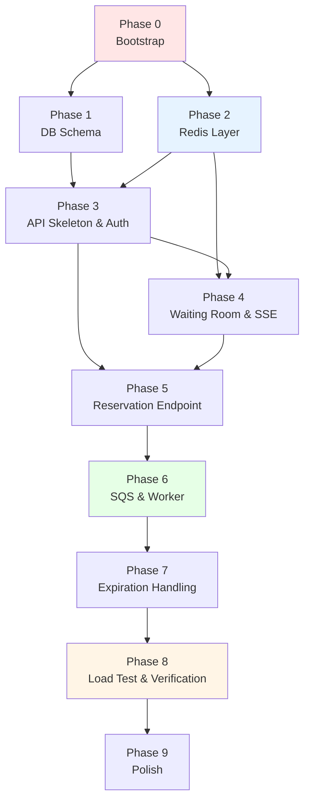
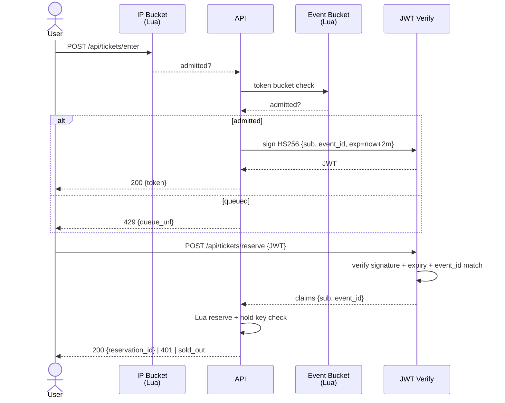
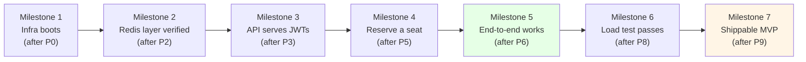
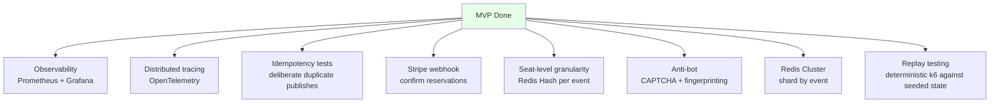

# Implementation Plan

> A phase-by-phase build order for Mini-Ticketmaster. Each phase leaves the system in a working state — you can stop after any phase and have something demonstrable.

For the *why* behind each architectural decision, see [architecture.md](./architecture.md). This document is the *how* and *when*.

---

## Table of Contents

1. [Phase Dependency Graph](#phase-dependency-graph)
2. [Tech Stack & Dependencies](#tech-stack--dependencies)
3. [Environment Variables](#environment-variables)
4. [The Phases](#the-phases)
   - [Phase 0 — Bootstrap](#phase-0--bootstrap)
   - [Phase 1 — Database Schema](#phase-1--database-schema)
   - [Phase 2 — Redis Layer](#phase-2--redis-layer)
   - [Phase 3 — API Skeleton & Auth](#phase-3--api-skeleton--auth)
   - [Phase 4 — Waiting Room & SSE](#phase-4--waiting-room--sse)
   - [Phase 5 — Reservation Endpoint](#phase-5--reservation-endpoint)
   - [Phase 6 — SQS & Worker](#phase-6--sqs--worker)
   - [Phase 7 — Expiration Handling](#phase-7--expiration-handling)
   - [Phase 8 — Load Test & Verification](#phase-8--load-test--verification)
   - [Phase 9 — Polish](#phase-9--polish)
5. [Milestones](#milestones)
6. [Risk Watchlist](#risk-watchlist)
7. [Definition of Done](#definition-of-done)
8. [Stretch Goals (Post-MVP)](#stretch-goals-post-mvp)

---

## Phase Dependency Graph



**The critical path is P0 → P2 → P3 → P5 → P6 → P8.** Phases 1, 4, 7, 9 can flex around it.

---

## Tech Stack & Dependencies

### Go libraries

```bash
# Core
go get github.com/go-chi/chi/v5              # router
go get github.com/redis/go-redis/v9          # Redis client
go get github.com/golang-jwt/jwt/v5          # JWT
go get github.com/google/uuid                # reservation_id generation
go get github.com/jackc/pgx/v5               # Postgres driver + pool
go get github.com/aws/aws-sdk-go-v2          # AWS SDK core
go get github.com/aws/aws-sdk-go-v2/config    # AWS config loader
go get github.com/aws/aws-sdk-go-v2/service/sqs  # SQS client
go get github.com/joho/godotenv              # .env file loading

# Testing
go get github.com/stretchr/testify            # assertions
```

### External services (via Docker Compose)


| Service     | Image                           | Port                  | Purpose                    |
| ------------- | --------------------------------- | ----------------------- | ---------------------------- |
| Redis 7     | `redis:7-alpine`                | 6379                  | Hot-path datastore         |
| Postgres 16 | `postgres:16-alpine`            | 5432                  | Source of truth            |
| ElasticMQ   | `softwaremill/elasticmq-native` | 9324 (API), 9325 (UI) | Local SQS-compatible queue |

### Tooling (host machine)


| Tool        | Install                                    | Purpose                |
| ------------- | -------------------------------------------- | ------------------------ |
| Go 1.22+    | `brew install go`                          | Build                  |
| k6          | `brew install k6`                          | Load testing           |
| AWS CLI     | `brew install awscli`                      | Create local SQS queue |
| `psql`      | comes with Postgres or`brew install libpq` | DB queries             |
| `redis-cli` | `brew install redis`                       | Redis inspection       |

---

## Environment Variables

Create `.env.example` and copy to `.env`:

```bash
# API server
API_PORT=8080
JWT_SECRET=change-me-to-32-bytes-of-randomness

# Redis
REDIS_ADDR=localhost:6379
REDIS_DB=0

# Postgres
POSTGRES_HOST=localhost
POSTGRES_PORT=5432
POSTGRES_USER=tickets
POSTGRES_PASSWORD=tickets
POSTGRES_DB=tickets

# SQS (point at ElasticMQ locally, real AWS in prod)
AWS_REGION=us-east-1
AWS_ACCESS_KEY_ID=local
AWS_SECRET_ACCESS_KEY=local
SQS_ENDPOINT=http://localhost:9324
SQS_QUEUE_URL=http://localhost:9324/000000000000/reservations

# Worker
WORKER_LONG_POLL_SECONDS=20
SWEEP_INTERVAL_SECONDS=60
```

---

## Auth Design (lite)

A minimal, acceptable-standard auth model. Industry defaults, nothing fancy.

**The whole auth surface in one table:**

| Piece | Decision | Why it's enough |
|---|---|---|
| Algorithm | **HS256** | Symmetric, one secret, simplest for single-service systems |
| Claims | `sub`, `event_id`, `exp` only | Event scope stops cross-event token reuse; short expiry limits blast radius |
| Expiry | **2 minutes** | Industry default for queue-admission tokens |
| Secret | **32 random bytes** in `.env`; panic at startup if missing or shorter | HS256 key strength (256 bits) |
| User identity | Client provides `user_id` in `/enter` request body | k6-friendly; persist in cookie in real frontend |
| Per-user rate limit | Enforced by Lua hold key check | One reservation per user per 600 s, atomically |
| Per-IP rate limit | Token bucket at `/enter` (Lua script) | Blocks bulk bots before they reach the event bucket |

**Explicitly out of scope** (add as stretch if needed):

- JTI replay tracking — 2-min expiry already limits replay window
- `iss` / `aud` claim validation — single service, not multi-tenant
- RS256 + JWKS — verifyer ≠ signer scenario, doesn't apply here
- CAPTCHA / device fingerprinting — external service + accessibility concerns; real Ticketmaster only adds these for the *biggest* drops
- Login / OAuth / passwords — big drops work better anonymous; Stripe handles identity at payment time

**Generate the secret once during setup:**

```bash
openssl rand -hex 32   # → paste into JWT_SECRET in .env
```

**Flow:**



---

## The Phases

---

### Phase 0 — Bootstrap

**Goal:** the whole infrastructure stack runs with one command.

**Why first:** every later phase needs Redis, Postgres, and ElasticMQ available. Boot them now so you don't have to context-switch later.

**Files created:**

```
ticket-deal/
├── .gitignore
├── .env.example
├── docker-compose.yml
├── go.mod
├── go.sum
└── README.md  (already exists)
```

**docker-compose.yml** defines three services with healthchecks so `depends_on` is meaningful.

**Verification:**

```bash
docker compose up -d
docker compose ps                # all 3 services "healthy"
redis-cli -h localhost ping      # PONG
psql -h localhost -U tickets -d tickets -c "SELECT 1;"   # 1
curl http://localhost:9324/      # ElasticMQ responds
```

**Estimated effort:** 30 minutes.

---

### Phase 1 — Database Schema

**Goal:** Postgres has the tables the worker will write to, with the unique constraint that makes idempotency safe.

**Files created:**

```
migrations/
├── 001_init.sql
└── 002_seed.sql       (optional, for local dev)
```

**`001_init.sql`:**

```sql
CREATE TABLE events (
    id              BIGINT PRIMARY KEY,
    name            TEXT NOT NULL,
    initial_inventory INTEGER NOT NULL,
    created_at      TIMESTAMPTZ NOT NULL DEFAULT NOW()
);

CREATE TABLE reservations (
    reservation_id  UUID PRIMARY KEY,           -- idempotency key
    user_id         TEXT NOT NULL,
    event_id        BIGINT NOT NULL REFERENCES events(id),
    status          TEXT NOT NULL
                    CHECK (status IN ('PENDING_PAYMENT', 'CONFIRMED', 'EXPIRED', 'CANCELLED')),
    expires_at      TIMESTAMPTZ NOT NULL,
    created_at      TIMESTAMPTZ NOT NULL DEFAULT NOW(),
    updated_at      TIMESTAMPTZ NOT NULL DEFAULT NOW()
);

CREATE INDEX idx_reservations_event_status
    ON reservations(event_id, status);

CREATE INDEX idx_reservations_pending_expiry
    ON reservations(expires_at)
    WHERE status = 'PENDING_PAYMENT';
```

**Verification:**

```bash
psql -h localhost -U tickets -d tickets -f migrations/001_init.sql
psql -h localhost -U tickets -d tickets -c "\d reservations"
# Confirm: reservation_id is PRIMARY KEY (the unique constraint we need for ON CONFLICT)
```

**Estimated effort:** 30 minutes.

---

### Phase 2 — Redis Layer

**Goal:** the two Lua scripts are loaded, the Go wrapper around them returns typed results, and a unit test proves that 1,000 concurrent calls produce exactly the right number of reservations.

**Files created:**

```
internal/
├── redis/
│   ├── client.go              # connection pool, graceful close
│   ├── scripts/
│   │   ├── reserve.lua
│   │   └── token_bucket.lua
│   ├── reserve.go             # ReserveSeat(ctx, eventID, userID, ttl) -> Result
│   └── waitingroom.go         # TryAdmit, Enqueue, GetPosition, Promote
└── testutil/
    └── miniredis.go           # helper for tests (or use real Redis)
```

**The two Lua scripts** go here verbatim from [architecture.md §4](./architecture.md#4-phase-2--atomic-seat-locking).

**Verification:**

```bash
go test ./internal/redis/...
```

A test like:

```go
func TestReserve_NoOversell(t *testing.T) {
    // Seed inventory:event:42 = 10
    // Fire 1000 goroutines, each calling ReserveSeat
    // Assert: exactly 10 reservations, 990 sold_outs, no errors
}
```

**Estimated effort:** 1 day (writing Lua + Go wrappers + tests).

**Why this phase matters:** if Phase 2 isn't bulletproof, nothing else saves you. This is where the system's correctness lives.

---

### Phase 3 — API Skeleton & Auth

**Goal:** the Go API starts, exposes `/healthz`, and implements the **lite auth** (HS256 JWT with `{sub, event_id, exp}` claims, 2-min expiry). No business logic yet — just authentication plumbing.

> Design rationale: see [Auth Design (lite)](#auth-design-lite) above.

**Files created:**

```
cmd/
└── api/
    └── main.go                # chi router, env config, graceful shutdown

internal/
├── config/
│   └── config.go              # env loading via godotenv
├── auth/
│   ├── jwt.go                 # Issue, Verify
│   └── middleware.go          # chi middleware that verifies Bearer token
└── apiutil/
    └── response.go            # JSON helpers, error mapping
```

**main.go** sets up:

```go
// Validate JWT secret at startup — fail fast if missing or too short
secret := os.Getenv("JWT_SECRET")
if len(secret) < 32 {
    log.Fatal("JWT_SECRET must be at least 32 bytes (use `openssl rand -hex 32`)")
}

r := chi.NewRouter()
r.Use(middleware.Logger)
r.Use(middleware.Recoverer)
r.Get("/healthz", healthHandler)

// Routes mounted now; handlers filled in by later phases.
// Note: /reserve requires JWT from day 1 — middleware wired even though handler is a stub.
r.Route("/api/tickets", func(r chi.Router) {
    r.Post("/enter", nil)                              // Phase 4
    r.With(auth.Middleware).Post("/reserve", nil)      // Phase 5
})

http.ListenAndServe(":8080", r)
```

**Verification:**

```bash
# 1. API starts cleanly
go run ./cmd/api &
curl http://localhost:8080/healthz
# {"status":"ok"}

# 2. Missing JWT_SECRET → fail fast
JWT_SECRET="" go run ./cmd/api
# log.Fatal: JWT_SECRET must be at least 32 bytes ...

# 3. Unit tests for Issue + Verify
go test ./internal/auth/...
# PASS

# 4. End-to-end (once Phase 4 lands the /enter handler)
TOKEN=$(curl -s -X POST localhost:8080/api/tickets/enter \
  -H "Content-Type: application/json" \
  -d '{"user_id":"u1","event_id":"42"}' | jq -r .token)

# Inspect the JWT payload
echo $TOKEN | cut -d. -f2 | base64 -d 2>/dev/null
# {"sub":"u1","event_id":42,"exp":1727452920}

# Tampered token rejected
curl -H "Authorization: Bearer not.a.real.token" http://localhost:8080/api/tickets/reserve
# 401

# Expired token rejected (wait 3 min after issuing, then retry)
# 401
```

**Estimated effort:** 1 day.

---

### Phase 4 — Waiting Room & SSE

**Goal:** Phase 1 of the gatekeeper works end-to-end. Users get either a JWT or a 429 with an SSE stream.

**Files created/modified:**

```
cmd/api/main.go                        # mount new routes
internal/
├── iplimit/
│   └── bucket.go                      # IP-based token bucket (Lua) — first line of defense
└── waitingroom/
    ├── bucket.go                      # per-event token bucket wrapper
    ├── queue.go                       # ZSET helpers (ZADD, ZRANK, ZREM)
    ├── drainer.go                     # background goroutine promoting users
    └── handler.go                     # HTTP handlers for /enter and /queue
```

**Two layers of rate limiting in `/enter`:**

1. **IP bucket first** — blocks bulk bots before they consume event-bucket tokens
2. **Event bucket second** — admits at the configured rate for this specific event

**Two routes added:**


| Route                | Method    | Behavior                               |
| ---------------------- | ----------- | ---------------------------------------- |
| `/api/tickets/enter` | POST      | Token bucket → JWT, or ZADD → 429    |
| `/api/tickets/queue` | GET (SSE) | Stream`{position, eta_seconds}` events |

**Verification:**

```bash
# Burst test with curl in a loop (or a small Go script)
for i in $(seq 1 50); do
  curl -s -X POST localhost:8080/api/tickets/enter \
    -H "Content-Type: application/json" \
    -d '{"user_id":"u'$i'","event_id":"42"}' &
done | grep -E '(token|queue_url)' | sort | uniq -c
# Expect: ~capacity admitted (get token), rest get queue_url
```

**SSE verification:**

```bash
# In another terminal, get queued
RESP=$(curl -s -i -X POST localhost:8080/api/tickets/enter ...)
curl -N -H "Accept: text/event-stream" "$QUEUE_URL"
# Watch position count down
```

**Estimated effort:** 1 day.

---

### Phase 5 — Reservation Endpoint

**Goal:** Phase 2 of the gatekeeper works. Valid JWT + available seats → reservation_id returned. Otherwise, `sold_out` or `already_holding`.

**Files created/modified:**

```
cmd/api/main.go                        # mount /api/tickets/reserve
internal/api/
└── reserve_handler.go                 # calls redis.Reserve, sets hold key
```

**Route added:**


| Route                  | Method | Auth | Behavior                                                                 |
| ------------------------ | -------- | ------ | -------------------------------------------------------------------------- |
| `/api/tickets/reserve` | POST   | JWT  | Lua reserve → hold key (EX 600) → return`{reservation_id, expires_in}` |

**Stub the SQS publish for now** — just log the message body. We'll wire real SQS in Phase 6.

**Verification:**

```bash
TOKEN=$(...)
redis-cli SET inventory:event:42 10
curl -X POST -H "Authorization: Bearer $TOKEN" \
  -H "Content-Type: application/json" \
  -d '{"user_id":"u1","event_id":"42"}' \
  localhost:8080/api/tickets/reserve
# {"reservation_id":"...","expires_in":600}

# Verify hold key exists
redis-cli TTL "hold:event:42:user:u1"   # ~600
# Verify inventory decremented
redis-cli GET inventory:event:42        # 9

# Second call same user → already_holding
curl -X POST ... # {"error":"already_holding"}
```

**Estimated effort:** 1 day.

---

### Phase 6 — SQS & Worker

**Goal:** the full flow works end-to-end. Reservation → SQS message → worker → Postgres row.

**Files created:**

```
cmd/
├── api/main.go                         # already exists, now publishes to SQS
└── worker/
    └── main.go                         # SQS consumer loop

internal/
├── queue/
│   ├── publisher.go                    # SendMessage wrapper
│   └── consumer.go                     # ReceiveMessage + DeleteMessage loop
└── db/
    ├── pool.go                         # pgx connection pool
    └── reservations.go                 # InsertIfAbsent (ON CONFLICT DO NOTHING)
```

**docker-compose.yml** gets ElasticMQ service added in this phase.

**Worker logic (cmd/worker/main.go):**

```go
for {
    msgs := sqs.ReceiveMessage(QueueURL, MaxNumberOfMessages=10, WaitTimeSeconds=20)
    for _, msg := range msgs {
        body := parseReservation(msg.Body)
        err := db.InsertIfAbsent(body)   // ON CONFLICT DO NOTHING
        if err != nil { continue }        // don't delete; let SQS redeliver
        sqs.DeleteMessage(QueueURL, msg.ReceiptHandle)
    }
}
```

**Verification:**

```bash
# Make sure ElasticMQ is up and queue exists
aws --endpoint-url=http://localhost:9324 sqs create-queue --queue-name reservations

# Start both processes
go run ./cmd/api &
go run ./cmd/worker &

# Reserve a seat via curl
# ... (use token from Phase 5)
curl ... # {"reservation_id":"abc-123",...}

# Within a few seconds:
psql -h localhost -U tickets -d tickets \
  -c "SELECT * FROM reservations WHERE reservation_id='abc-123';"
# Should show the row with status='PENDING_PAYMENT'
```

**Idempotency test:**

```bash
# Manually publish the same message twice to SQS
aws --endpoint-url=http://localhost:9324 sqs send-message \
  --queue-url http://localhost:9324/000000000000/reservations \
  --message-body '{"reservation_id":"abc-123","user_id":"u1","event_id":"42","expires_at":"..."}'

# Wait, run worker, query:
psql -c "SELECT COUNT(*) FROM reservations WHERE reservation_id='abc-123';"
# Must be 1, not 2 (ON CONFLICT DO NOTHING works)
```

**Estimated effort:** 2 days (this is the biggest phase).

---

### Phase 7 — Expiration Handling

**Goal:** when a hold key expires, the seat returns to inventory. Two layers: event-driven (fast) + sweep (safety net).

**Files created:**

```
cmd/
└── expiration-watcher/
    └── main.go                         # PSUBSCRIBE __keyevent@0__:expired → INCR

internal/
└── expire/
    ├── watcher.go                      # keyspace notification subscriber
    └── sweep.go                        # cron every 60s
```

**Wiring:**

- Redis container started with `--notify-keyspace-events Ex` in docker-compose.yml
- `cmd/expiration-watcher` runs as a separate process (or as a goroutine in cmd/worker — design choice)
- Sweep logic added as a goroutine inside `cmd/worker`

**Verification:**

```bash
# Manually create a hold key with short TTL
redis-cli SET "hold:event:42:user:test" 1 EX 5
redis-cli SET inventory:event:42 0
sleep 10
redis-cli GET inventory:event:42   # back to 1 (keyspace notification fired)

# Test sweep path: insert expired PENDING_PAYMENT row directly
psql -c "INSERT INTO reservations (reservation_id, user_id, event_id, status, expires_at) VALUES ('xyz', 'u1', 42, 'PENDING_PAYMENT', NOW() - INTERVAL '1 hour');"
sleep 65
psql -c "SELECT status FROM reservations WHERE reservation_id='xyz';"
# status='EXPIRED' (sweep updated it)
```

**Estimated effort:** 1 day.

---

### Phase 8 — Load Test & Verification

**Goal:** prove the system handles 1,000 concurrent users without overselling, with a script that asserts the invariant.

**Files created:**

```
loadtest/
├── burst.js                # k6 burst test
└── lib/
    └── helpers.js          # reusable k6 helpers

scripts/
└── verify.sh               # post-test invariant checks
```

**k6 script** does the two-phase flow:

1. `POST /api/tickets/enter` → get JWT (handle 429 gracefully)
2. `POST /api/tickets/reserve` with JWT → record outcome

**`scripts/verify.sh`** asserts:

```bash
#!/usr/bin/env bash
set -euo pipefail

INITIAL=10

REDIS_INV=$(redis-cli GET inventory:event:42)
PG_COUNT=$(psql -t -c "SELECT COUNT(*) FROM reservations WHERE event_id=42 AND status IN ('PENDING_PAYMENT','CONFIRMED');")

echo "Redis inventory: $REDIS_INV"
echo "Postgres reservations: $PG_COUNT"
echo "Initial inventory: $INITIAL"

TOTAL=$((REDIS_INV + PG_COUNT))
if [ "$TOTAL" -ne "$INITIAL" ]; then
    echo "FAIL: inventory leak ($REDIS_INV + $PG_COUNT = $TOTAL, expected $INITIAL)"
    exit 1
fi

if [ "$PG_COUNT" -gt "$INITIAL" ]; then
    echo "FAIL: overselling ($PG_COUNT reservations for $INITIAL seats)"
    exit 1
fi

echo "PASS"
```

**Verification:**

```bash
# Reset state
redis-cli SET inventory:event:42 10
psql -c "DELETE FROM reservations WHERE event_id=42;"

# Run k6
k6 run loadtest/burst.js

# Assert invariant
./scripts/verify.sh   # PASS
```

**Estimated effort:** 0.5 day.

---

### Phase 9 — Polish

**Goal:** the project is cloneable and runnable by someone other than you.

**Files created/modified:**

```
Makefile                   # make up, make test, make loadtest, make verify
.env.example               # all required vars (already from Phase 0)
README.md                  # ensure quick-start works end-to-end
.gitignore                 # ignore .env, *.test, coverage.out
```

**Makefile targets:**

```makefile
.PHONY: up down test loadtest verify migrate

up:
	docker compose up -d
migrate:
	psql -h localhost -U tickets -d tickets -f migrations/001_init.sql
test:
	go test ./...
loadtest:
	k6 run loadtest/burst.js
verify:
	./scripts/verify.sh
down:
	docker compose down -v
```

**Verification:**

```bash
# Fresh clone test: clone to /tmp, run the full sequence
git clone ... /tmp/test-clone
cd /tmp/test-clone
make up && make migrate && make test
# Everything works without manual intervention
```

**Estimated effort:** 0.5 day.

---

## Milestones

These are demo-ready checkpoints where you can stop and show something working.




| Milestone            | What you can show                                                |
| ---------------------- | ------------------------------------------------------------------ |
| **M1** — Infra      | `docker compose up` → Redis, Postgres, ElasticMQ all healthy    |
| **M2** — Redis      | Go test proves 1,000 concurrent reserves = exactly N successes   |
| **M3** — API        | `curl /healthz` returns 200; JWT round-trip works                |
| **M4** — Reserve    | `curl /reserve` with JWT decrements inventory and creates a hold |
| **M5** — End-to-end | Reserve → row in Postgres within a few seconds                  |
| **M6** — Load test  | 1,000 VUs, zero overselling,`verify.sh` says PASS                |
| **M7** — MVP        | Fresh clone →`make up && make migrate && make test` works       |

**Total MVP effort:** ~7–8 days at casual pace, ~3–4 days at focused pace.

---

## Risk Watchlist

Things that will bite you if you don't watch for them. Listed in roughly the order you'll hit them.


| #  | Risk                                                          | Where                         | Mitigation                                                                                                    |
| ---- | --------------------------------------------------------------- | ------------------------------- | --------------------------------------------------------------------------------------------------------------- |
| 1  | Redis container doesn't enable keyspace notifications         | Phase 7 silently does nothing | Add`command: redis-server --notify-keyspace-events Ex` to docker-compose.yml                                  |
| 2  | ElasticMQ port conflicts with LocalStack                      | Phase 6                       | Use 9324 (ElasticMQ default), not 4566 (LocalStack default)                                                   |
| 3  | JWT secret too short                                          | Phase 3 verification fails    | Use 32+ random bytes; check at startup, panic if missing                                                      |
| 4  | `redis-cli` not installed locally                             | Phase 0 verification          | `brew install redis`                                                                                          |
| 5  | Lua script caching (`EVALSHA` vs `EVAL`)                      | Phase 2                       | Use`EVAL` for simplicity first; switch to `EVALSHA` with reload only if profiling shows it matters            |
| 6  | SSE connection leaks                                          | Phase 4                       | Use context cancellation; ensure drainer goroutine respects shutdown                                          |
| 7  | Worker double-processing on shutdown                          | Phase 6                       | Don't call`DeleteMessage` until after successful commit; let SQS visibility timeout handle the race           |
| 8  | k6 WebSocket/SSE support confusion                            | Phase 8                       | k6 has experimental`k6/experimental/websockets` — for SSE we just use `http.get` with `tags: {stream: true}` |
| 9  | Postgres connection pool too small                            | Phase 6                       | pgx default is fine for worker (1 conn); API doesn't talk to Postgres in hot path                             |
| 10 | Redis`notify-keyspace-events` events fire but watcher is down | Phase 7                       | Sweep job (Approach B) is the safety net — never ship without it                                             |

---

## Definition of Done

The MVP is "done" when **all** of these are true:

- [ ]  `make up` brings the whole stack up healthy
- [ ]  `make migrate` creates the schema idempotently
- [ ]  `make test` runs all Go tests green
- [ ]  `make loadtest` runs k6 against a freshly seeded event
- [ ]  `make verify` reports PASS (no overselling, no inventory leak)
- [ ]  Hold key expiry returns seats to inventory within 60 s (keyspace OR sweep)
- [ ]  Worker crash mid-message → message redelivered → INSERT idempotent → no duplicate row
- [ ]  JWT forgery rejected (verify middleware works)
- [ ]  SSE stream shows queue position decreasing for queued users
- [ ]  Fresh clone → `make up && make migrate && make loadtest && make verify` → PASS

---

## Stretch Goals (Post-MVP)

From the README roadmap, ordered by learning value:



Suggested order:

1. **Observability first** — you can't debug what you can't see
2. **Tracing second** — connects "what happened" across API → SQS → worker
3. **Idempotency tests third** — load-test specifically for duplicate SQS messages
4. **Stripe webhook fourth** — first "real money" integration; the most fun
5. The rest as interest dictates

---

## See also

- [README](../README.md) — project landing page
- [architecture.md](./architecture.md) — why each piece exists and what failure it prevents
- `/docs/tooling.md` (coming soon)
- `/docs/loadtest.md` (coming soon)
- `/docs/operations.md` (coming soon)
